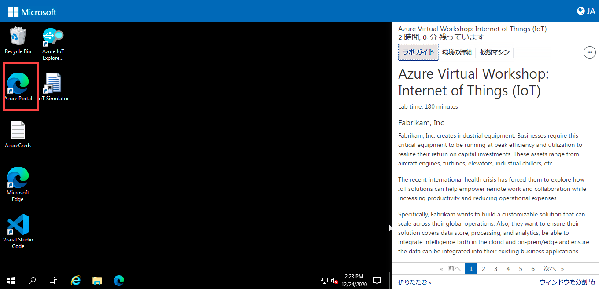
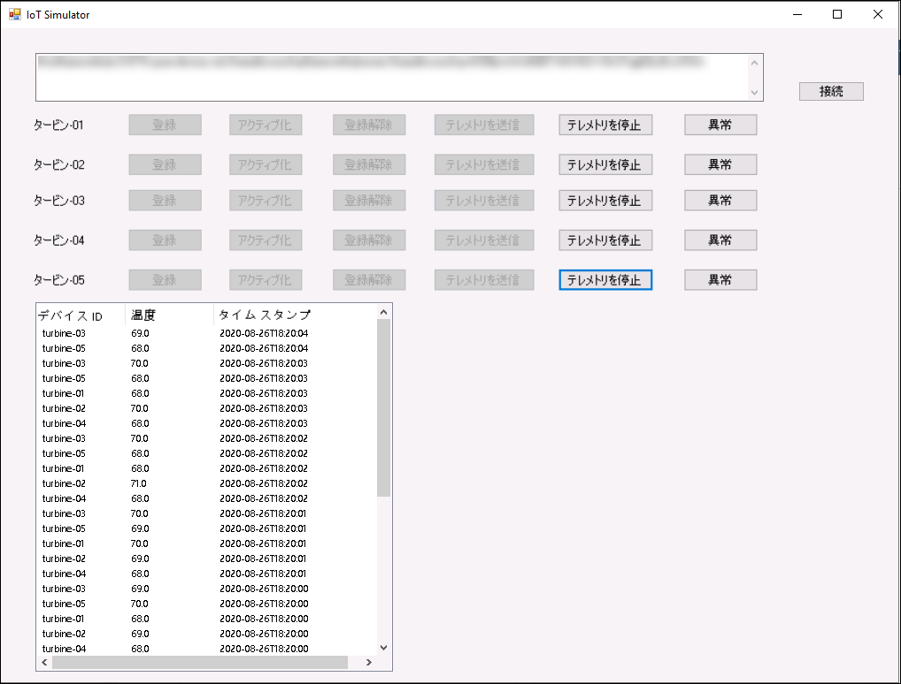
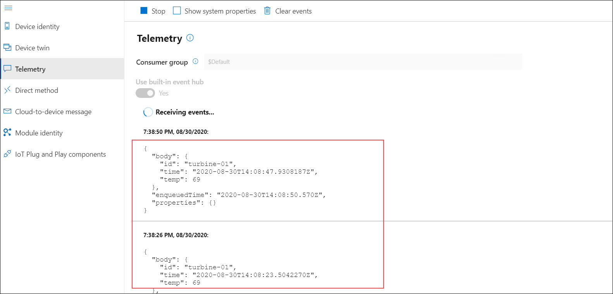

# 演習 1: Azure IoT サービスを使い始める

## シナリオ

Fabrikam, Inc. 製の *Turbine (デバイス)* は世界中にデプロイされています。Azure IoT Hub によってテレメトリが受信され、信頼性が高くスケーラブルな方法ですべてのデバイスが一元管理されるよう、Azure IoT Hub ソリューションを構成する必要があります。

## 概要

この演習では、世界中にデプロイされた Turbine デバイスを Azure IoT Hub に接続し、Turbine デバイスから Azure IoT Hub へテレメトリ データが送信されるよう設定します。

目標を達成するために、次のアクティビティを実行します。

* Azure Portal にログインし、事前に作成されている Azure IoT Hub およびその他のリソースを確認します。 
* デバイス (シミュレートされる) を Azure IoT Hub に登録します。
* デバイス (シミュレートされる) を有効にします。
* テレメトリをデバイスから Azure IoT Hub へ送信します。
* Azure IoT Hub IoT Explorer でテレメトリ データ ストリームを確認します。

## 手順

### ラボの開始

1. 環境がプロビジョニングされると、ブラウザーの左側に仮想マシン (JumpVM)、右側にラボ ガイドが読み込まれます。ワークショップ全体でこの仮想マシンを使用して、ラボを実行します。

1. ラボ環境の詳細を見るには、**[環境の詳細]** タブを選択します。**[環境の詳細]** タブは右上にあります。さらに、資格情報はメールにより、登録時に入力したメール アドレスに送信されます。

   

 > **[環境の詳細]** タブには Suffix/DeploymentID の値が示されています。ラボの手順で SUFFIX または DeploymentID を使用する場合は、常にこの値を使用してください。これは、各ラボのデプロイに関連付けられた一意の番号です。 
 
#### タスク 1: Azure Portal にログインし、事前にデプロイされているリソースを確認する

1. JumpVM で、デスクトップ上の Azure Portal ショートカットをダブルクリックします。

     

1. **[Sign in to Microsoft Azure (Microsoft Azure にサインイン)]** ブレードで、ログイン画面が表示されます。そこに次のメールアドレス/ユーザー名を入力し、**[次へ]** をクリックします。 
   * メールアドレス/ユーザー名: <inject key="AzureAdUserEmail"></inject>

1. それから次のパスワードを入力し、**[サインイン]** をクリックします。
   * パスワード: <inject key="AzureAdUserPassword"></inject>

1. ポップアップ **[サインインの状態を維持]** が表示された場合は、[はい] をクリックします。

1. ポップアップ **[You have free Azure Advisor recommendations! (無料の Azure Advisor のお勧めがあります)]** が表示された場合は、閉じてラボを続行します。

1. **[Microsoft Azure へようこそ]** ポップアップ ウィンドウが表示された場合は、**[後で]** をクリックしてツアーをスキップします。
   
1. **[リソース グループ]** メニューを開くには、ポータル ウィンドウの左上隅にあるトグル メニュー アイコンをクリックしてから、**[リソース グループ]** をクリックします。

   

   このブレードには、Azure サブスクリプションにアクセスできるすべてのリソース グループが表示されます。

1. そこには、**iot-{deployment-id}** という名前の、作成済みのリソースがあります。このリソース グループには、ラボに必要なすべてのリソースが含まれています。このリソース グループを選択し、その中にある作成済みのリソースを確認してください。 

     

   > **注:** **デプロイ ID** はデプロイごとの固有番号です。デプロイ ID は右上隅の **[環境の詳細]** タブにあります。
    
#### タスク 2: Turbine デバイス (シミュレートされる) を Azure IoT Hub に接続する

**IoT Hub** は、保管または処理のために IoT デバイスからクラウドに大量のテレメトリを取り込むことを可能にする Azure サービスです。IoT Hub に関する詳しい資料はこちらにあります: ```https://docs.microsoft.com/en-us/azure/iot-hub/about-iot-hub```。

このタスクでは、Fabrikam, Inc. の Turbine デバイスを Azure IoT Hub に接続します。接続したら、テレメトリを IoT Hub に送信するように Turbine デバイスを構成します。実行する手順の概要は次のとおりです。

   * Turbine デバイスを IoT Hub に登録する
   * 登録したデバイスを、ソリューションの一部として有効にする
   * デバイスから IoT Hub へのデータの送信を開始する


1. 右側の **[環境の詳細]** タブから、**IotHubConnectionString** (接続文字列) の値をコピーします。この接続文字列は、次の手順で IoT Hub と Simulator アプリ間の接続を確立するため、および Azure IoT Explorer との接続を確立するために使用されます。

    > **注**: IoT Hub に移動して接続文字列を取得することもできます -> [設定] の下の [共有アクセス ポリシー] をクリックします -> [ポリシー] タブの下の iothubowner をクリックし、[接続文字列] の主キー値をコピーします。

1. Azure Portal を最小化し、仮想マシンのデスクトップで **IoT Simulator** ショートカットをクリックして、**IoT Simulator アプリ**を開きます。 

1. コピーした **[接続文字列]** 値をテキストボックスに貼り付けます。

1. 右側の **[接続]** ボタンをクリックして、IoT Hub との接続を確立します。

1. 接続が成功すると、ポップアップ メッセージ**「接続に成功しました」**が表示されます。**[OK]** をクリックすると、Turbine デバイスのリストが表示されます。それぞれ、設置されたデバイスをシミュレートしたものです。

   
   
1. IoT Simulator アプリ ダイアログで **タービン-01** の横にある **[登録]** をクリックして、デバイスを IoT Hub に登録します。

   

1. **IoT Hub Simulator アプリ**を最小化し、リソース グループに移動し、**iothub-{deployment-id}** という名前の IoT Hub を選択します。

1. [Explorers] セクションの下の **[IoT デバイス]** をクリックすると、登録済みの IoT デバイスがここにリストされていることがわかります。
 
   

1. IoT Simulator アプリを開き、登録済みデバイスの横にある **[アクティブ化]** ボタンをクリックして、IoT Hub レジストリでデバイス状態を「Disabled (無効)」から「Enabled (有効)」に変更することをシミュレートします。

   

   > **注: 上記の手順を繰り返して、すべてのデバイスを登録してアクティブ化してください**。 
                  
1. これで、デバイスを登録してアクティブ化できました。デバイスのリストを表示するには、Azure Portal に切り替えて、IoT Hub **iot-hub-{deployment-id}** を選択します。

  > **注: デバイスを表示するには、ブラウザーの再読み込みが必要である場合があります**。 

1. IoT Hub ブレードから、左側のメニューの [Explorers] で [IoT デバイス] を選択します。

1. すべてのデバイスがリストされ、アクティブ化したデバイスの状態は「Enabled (有効)」になっているはずです。

1. IoT Simulator アプリに戻り、**[テレメトリを送信]** をクリックします。しばらくすると、Simulator アプリのグリッドに、送信された各テレメトリ メッセージとシミュレートされた温度値がリストされます。

   
   
   これで、温度データを Azure IoT Hub に送信するように Turbine を構成できました。 
   
#### タスク 3: IoT Explorer を使用して Azure IoT Hub からのテレメトリ ストリームを確認する

**Azure IoT Explorer** は、IoT プラグ アンド プレイ プレビュー デバイスを操作およびテストするためのグラフィカル ツールです。このツールを使用して、デバイスが送信しているテレメトリを表示したり、デバイスのプロパティを操作したり、コマンドを呼び出したりできます。次のリンクから、Azure IoT Explorer の詳細を確認できます。```https://docs.microsoft.com/en-us/azure/iot-pnp/howto-use-iot-explorer```

このタスクでは、**Azure IoT Explorer** を使用して、シミュレートされた Turbine デバイスから Azure IoT Hub に送信されたテレメトリ データを確認します。

1. 仮想マシンのデスクトップで **[Azure IoT Explorer]** ショートカットをクリックして、Azure IoT Explorer アプリケーションを起動します。

1. IoT Hub ウィンドウで **[+ Add connection (接続を追加)]** をクリックします。

   

1. IoT Hub の **[接続文字列]** の値を入力します。前のタスクで Turbine デバイスを接続するために使用したのと同じ値です。

   > **注**: **[接続文字列]** 値は、ワークスペースの右側にある **[環境の詳細]** タブの **IoTHubConnectionString** にあります。
   
1. **[Save (保存)]** をクリックします。

   

1. **[デバイス]** ウィンドウの下に、前のタスクで接続して登録した **IoT デバイス**が表示されます。

1. デバイスのリストから **turbine-01** をクリックします。

   

1. 左側から **[Telemetry (テレメトリ)]** を選択し、**[Start (開始)]** オプションをクリックします。

   

   これにより、IoT Hub に送信されるデータを監視できます。これは同時に、デバイスが IoT Hub に接続して通信できていることを確認することにもなります。

1. 2 ～ 3 分後にテレメトリ データを受信し、次のようなメッセージが表示されます。サンプル データを見て、温度値を確認します。 
    
   
  
1. IoT Hub が Fabricam Inc. の Turbine デバイスからテレメトリを受信していることを確認したら、**[Stop (停止)]** を押してから **Azure IoT Explorer** アプリケーションを閉じます。

   
   
この演習では、Fabrikam, Inc. の Turbine デバイスを Azure IoT Hub に接続しました。また、デバイスがテレメトリを IoT Hub に送信できるようにし、それをテレメトリ ストリームで確認しました。
