# 演習 2: Azure IoT Hub からのデータの処理 

## シナリオ

Fabrikam, Inc. のチームは、すべての温度データがリアルタイムで利用・分析できるとともに、履歴分析とデータ保持のために長期保管されることを求めています。Fabrikam の管理チームは、リアルタイムのダッシュボードおよびレポートという形式でデータにアクセスできることを求めています。 

この要求を満たすには、Turbine デバイスによって生成されたすべてのデータをコールド パス分析用の長期ストレージに格納し、リアルタイム分析用にテレメトリ データのサブセットを変換する必要があります。さらに、Power BI と TSI Explorer を使用して、ホット パス データセットの視覚化を構成する必要もあります。

## 概要

この演習では、Stream Analytics を使用して、IoT Hub にあるデータを処理および変換します。コールド パス分析用にすべてのデータを Blob Storage に格納し、テレメトリ データのサブセットをフィルター処理して、Power BI のホット パスでのリアルタイム分析と視覚化を行います。

これには、次のタスクが含まれます。

* Stream Analytics ジョブを確認する
* Stream Analytics ジョブを開始する
* Storage Explorer を使用して Blob Storage 内のデータを確認する
* Power BI でホット パス データを視覚化する
* Time Series Insights Explorer を表示する

## ソリューション アーキテクチャ
 
   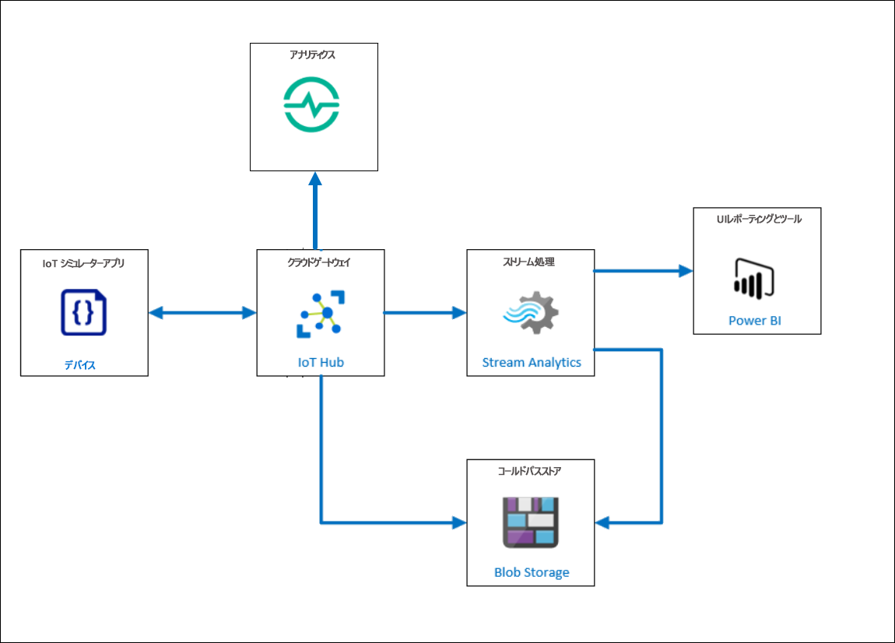      

### タスク 1: Stream Analytics ジョブを開始する
**Azure Stream Analytics** は、複数のソースからの大量の高速ストリーミング データを同時に分析および処理するように設計された、リアルタイム分析および複合イベント処理エンジンです。次のリンクから、Azure Stream Analytics の詳細を確認できます。```https://docs.microsoft.com/en-us/azure/stream-analytics/stream-analytics-introduction```

このタスクでは、事前定義された **Stream Analytics ジョブ**を実行して、IoT Hub からのデータを処理および変換します。Fabrikam Inc. が定期的に集計できるように、すべてのデータを長期保存用のストレージ アカウントに送信します。また、Power BI サービスにデータを送信して、1 分間枠で各デバイスによって報告された平均温度を示す「ホット」データを視覚化します。 


1. Azure Portal (```https://portal.azure.com```) に移動します。リソース グループ **iot-{deployment-id}** から、**iot-streamjob-{deployment-id}** という Stream Analytics ジョブを選択します。

1. 次に、ブレードの左側にある [ジョブ トポロジ] で、**[入力]** を選択し、入力ソースが IoT Hub と設定されている 1 つの入力ジョブがすでに定義されていることを確認します。この入力は、IoT Hub に送信される各イベントを処理するように Stream Analytics を設定します。

   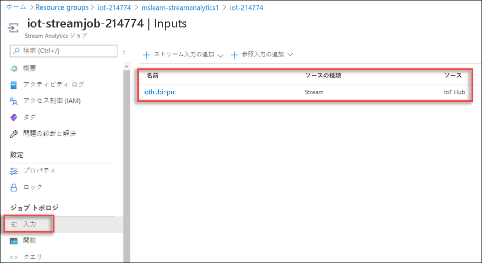

1. ここで、Stream Analytics ジョブ用に設定された出力データ ストリームを確認します。[ジョブ トポロジ] で **[出力]** を選択します。3 つの出力が設定されています。

 * **Blob 出力:**処理されたデータを Azure Blob Storage アカウントに格納します。この出力は、日付と時刻に基づいて個別のフォルダーを作成するように構成されています。
 * **Power BI 出力:**Power BI ワークスペースを接続して、Stream Analytics のリアルタイム データ ストリームにアクセスします。
 * **Service Bus 出力:**データを Service Bus 名前空間に送信します。次の演習では、Service Bus 出力がアラートの設定に使用されます。

1. 初回のログインであるため、Power BI ワークスペースの認証を更新する必要があります。  **powerbioutput** を選択し、**[承認の更新]** をクリックします。 

   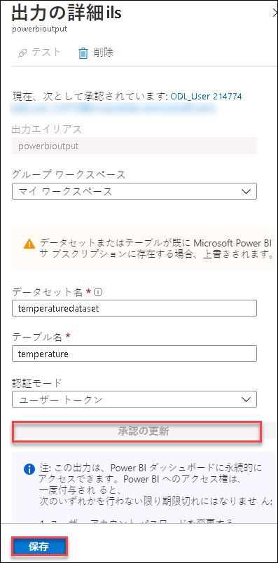

1. Azure 資格情報の入力を求められたら、[環境の詳細] タブから **Azure ユーザー名**と**パスワード**を入力し、**[保存]** をクリックします。

    * メールアドレス/ユーザー名: <inject key="AzureAdUserEmail"></inject>
    * パスワード: <inject key="AzureAdUserPassword"></inject>

1. *Stream Analytics ジョブ*の **[概要]** ブレードに戻り、データの変換と分析に使用されるクエリを観察します。 

       SELECT * INTO bloboutput FROM iothubinput; 
 
   > **注**: このクエリは、**iothubinput** からすべてのテレメトリ データを選択し、それを **bloboutput** に送信します。この基本的なクエリでは、Azure Stream Analytics ジョブを使用する必要はありません。代わりに、Azure IoT Hub 自体の**メッセージ ルーティング**機能を使用して、データをストレージ アカウントに格納できます。Azure Stream Analytics では、次のクエリで示すように、データを処理して変換することができます。次のリンクから、**メッセージ ルーティング**の詳細を確認できます。```https://docs.microsoft.com/en-us/azure/iot-hub/iot-hub-devguide-messages-d2c``` 

       SELECT AVG(temp) AS Average, id  INTO powerbioutput  FROM iothubinput  GROUP BY TumblingWindow(minute, 1), id;

   > **注**: このクエリは、「iothubinput」入力に着信するイベントを参照し、1 分のタンブリング ウィンドウでグループ化します。これは温度の平均と ID を「powerbioutput」出力に送信します。`TumblingWindow` 関数の詳細については、次のリンクを参照してください。```https://docs.microsoft.com/en-us/stream-analytics-query/tumbling-window-azure-stream-analytics```

1. [概要] ページで、**[開始]** をクリックします。

1. **[ジョブを開始]** ブレードで、**[今すぐ]** を選択し (ジョブはそれ以降メッセージの処理を開始します)、**[開始]** をクリックします。

1. Stream Analytics ジョブは開始されるまでに数分かかります。開始されると、概要ブレードの状態が [Running (実行中)] に変わります。
   
   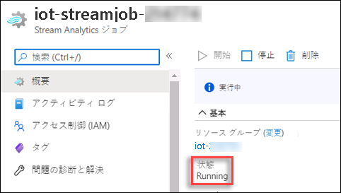

1. Stream Analytics ジョブが正常に開始されたら、**[概要]** ブレードの **[監視]** グラフで、**[Input Events (入力イベント)]** がゼロではないことを確認します。 

   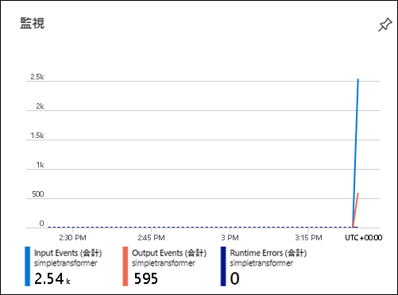
 
  > **注:**数分以内にデータが表示されない場合は、まずデバイスを非アクティブ化し、それから再登録することにより、IoT Simulator でデバイスを再接続する必要があります。登録したら、テレメトリを有効にして送信を開始します。 
  
### タスク 2: Storage Explorer を使用して Blob Storage 内のデータを確認する

Azure Storage は、耐久性があり、可用性が高く、非常にスケーラブルなクラウド ストレージ ソリューションです。次のリンクをたどると、Azure Storage の詳細を確認できます。```https://azure.microsoft.com/en-in/services/storage/```

このタスクでは、前のタスクで開始した Azure Stream 分析ジョブの結果として、ストレージ アカウント **iotstorage{deployment-id}** に格納されているデータを確認します。

1. リソース グループ iot-{deployment-id} に移動し、**iotstorage{deployment-id}** という名前のストレージ アカウントを選択します。

1. 左側のメニューで、**[Storage Explorer (プレビュー)]** をクリックします。

1. **[Storage Explorer (プレビュー)]** の **[BLOB コンテナー]** の下で、**temperaturecontainer** をクリックします。
 
1. 右側のウィンドウの **[名前]** の下で、**output** フォルダーをダブルクリックしてデータを表示します。 

   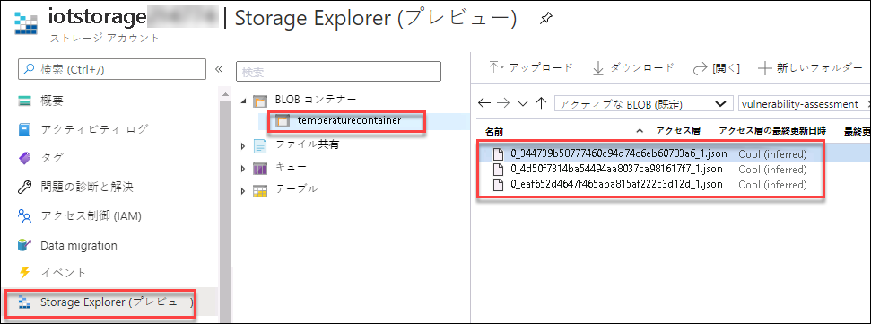
   
1. **[Storage Explorer (プレビュー)]** ウィンドウの下にある **[ダウンロード]** をクリックします。

   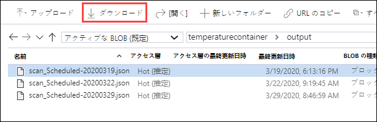
   
1. 次に、*[ここをクリックしてダウンロードを開始]* をクリックします。
   
   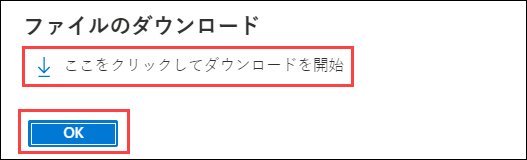

1. ダウンロードした JSON ファイルの内容を確認します。このファイルには、**id**、**time**、**temp**、**EventProcessUtcTime** などのエンティティが含まれています。

   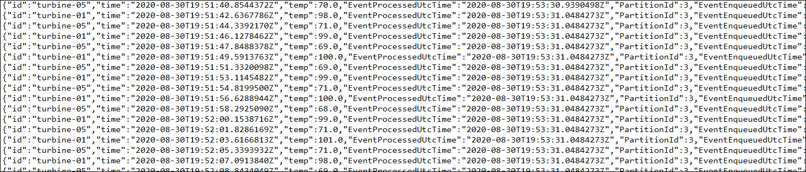
   
   これで、長期保存のためにデータを Azure Blob Storage に格納するようにソリューションを構成しました。 
  
### タスク 3: Power BI でホットデータを視覚化する

**Power BI** は、ソフトウェア サービス、アプリ、コネクタのコレクションであり、これらが連携して、無関係なデータソースを、一貫性があり、視覚的に没入でき、インタラクティブな分析情報に変えます。次のリンクから、Power BI の詳細を確認できます。```https://docs.microsoft.com/en-us/power-bi/fundamentals/power-bi-overview```.

このタスクでは、Power BI を使用して Stream Analytics によって処理されているホット データを視覚化します。
 
1. ラボの資格情報を使用して、Power BI アカウント (```https://app.powerbi.com```) にサインインします。

1. 左側のメニューで **[マイ ワークスペース]** を選択し、リストから **temperaturedataset** データセットを見つけます。

   > **注:**データセットが **[マイ ワークスペース]** の下の [Power BI データセット] タブに表示されるまでに数分かかる場合があります。

1. **temperaturedataset** の右側にあるその他のオプションの省略記号を選択し、ドロップダウン リストから **[レポートの作成]** オプションを選択します。
  
   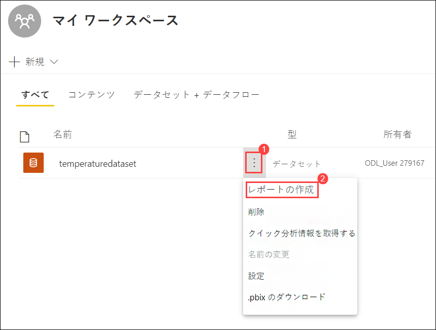
   
1. **[視覚化]** パレットで、**[積み上げ縦棒グラフ]** を選択して、グラフの視覚化を行います。

   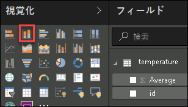

1. **[フィールド]** リストで、**[id]** フィールドをドラッグし、**[軸]** フィールドにドロップします。

1. 次に、**[Average]** (平均) フィールドをドラッグして、**[値]** フィールドにドロップします。

   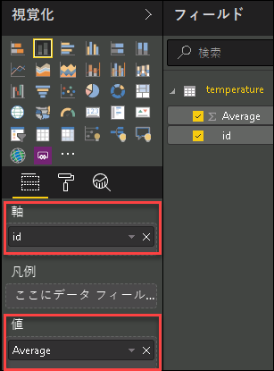

1. 次に、**[Average]** の横にある下向き矢印を選択して、**[最大値]** を選択します。これで、**[値]** が **[Max of average (平均の最大値)]** に設定されます。

   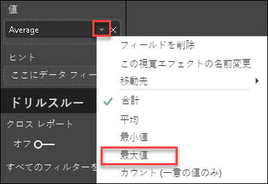

1. 手順 4 ～ 6 を繰り返します。今回は、**[Average]** の横にある下向き矢印を選択して、**[最小値]** を選択します。これで、**[Min of average (平均の最小値)]** の積み上げ縦棒グラフが追加されます。 
   
   > **注:**ID グラフの視覚化による [Max of average (平均の最大値)] の選択を解除するには、レポート デザイナーの画面で、任意の空白領域を選択することが必要になる場合があります。

1. 次に、**[table visualization (テーブルの視覚化)]** を追加します。

   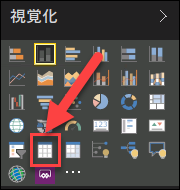

1. **[値]** フィールドで両方のフィールドをドラッグアンドドロップし、**[Average]** (平均) の横にあるドロップダウンを選択して、**[Average]** を選択して、値を **[id]** と **[Average of Average]** に設定します。

   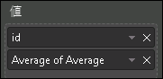

1. [ファイル] に移動し、ドロップダウンから **[保存]** を選択して、レポートを保存します。

   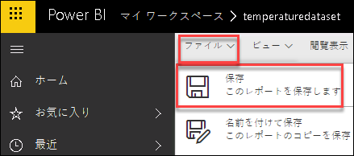

1. `Average Temperatures` という名前を入力し、**[保存]** を選択します。

1. レポート内で、列の 1 つを選択して、特定のデバイスのデータを表示します。 

これで、Turbines データ ストリームを視覚化するように Power BI を構成しました。 
   
### タスク 4: Time Series Insights Explorer を表示する 

**Azure Time Series Insights (TSI)** は、IoT ソリューションから大規模にデータを収集、処理、格納、分析、照会するために使用される、エンドツーエンドの**サービスとしてのプラットフォーム** オファリングです。TSI は、高度にコンテキスト化され時系列に最適化されたデータの、アドホック データ探索および運用分析用に設計されています。次のリンクをたどると、Time Series Insights の詳細を確認できます。```https://docs.microsoft.com/en-us/azure/time-series-insights/overview-what-is-tsi```

このタスクでは、Time Series Insights の統合はすでに Azure IoT Hub で行われており、TSI Explorer でデータを分析します。デバイスからの過去約 20 分間のデータしかないため、**Time Series Insights** を調べるのに十分なデータではありません。Time Series Insights の機能を学習するために、組み込みのデモ環境を使用して TSI を調べます。

1. リソース グループ タイルで、**iot-{deployment-id}** をクリックし、**iot-tsi-{deployment-id}** という名前の時系列環境を選択します。

1. **Time Series Insights 環境**ブレードの **[概要]** ペインの上にある **[Go to TSI Explorer (TSI Explorer に移動)]** をクリックします。

   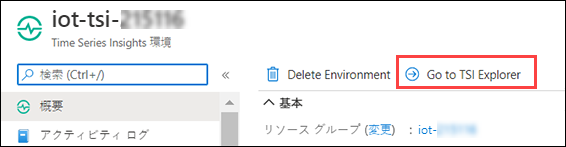

   これにより、**Time Series Insights Explorer** が新しいブラウザー タブで開きます。

1. TSI Explorer ウィンドウにログインすると、登録した各デバイスの時系列インスタンスが表示されます。
  
   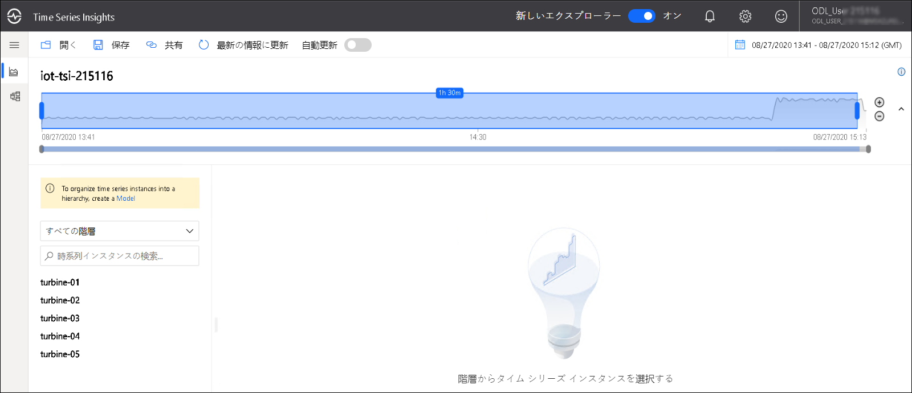
   
      > **注:**インスタンスが表示されるまでに数分かかる場合があります。時系列インスタンスが表示されない場合でも、次の手順に進んでください。 
  
1. ここでデモ環境にアクセスし、右上隅のユーザー ウィンドウをクリックして、ドロップダウンから **[View Demo Environment (デモ環境の表示)]** を選択します。

   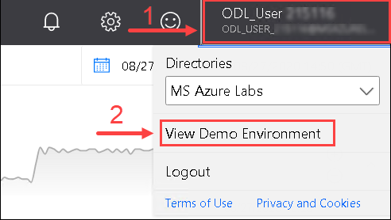
 
1. 左側のメニューから **[分析]** を選択すると、環境に 2 つのサンプル データセット **Contoso Plant 1** と **Contoso Plant 2** が読み込まれます。

1. 左側のメニューから **[モデル]** を選択し、使用可能なモデルを確認します。

1. 左側のメニューから **[分析]** を選択します。

1. Time Series Insights データ エクスプローラーが新しいタブで開きます。既定では、すべてのイベントの数を表示するグラフが表示されます。グラフのすぐ下にタイムラインがあり、さらにその下に数時間を示す、さらにマクロレベルのタイムラインがあることに注目してください。
  
1. **削除** アイコンをクリックして、既存のクエリを削除します。

   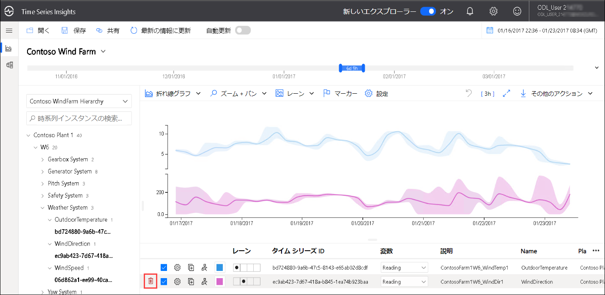

   > **注**: 削除アイコンを確認するには、カーソルを選択したクエリの左側に移動してください。
      
1. 左側のウィンドウで、[Contoso Plant 1] **->** [W6] **->** [Weather System] **->** OutdoorTemperature の順に展開します。

1. リストされたデータをクリックしてから、**[Reading (読み取り)]** を選択し、**[追加]** をクリックします。

   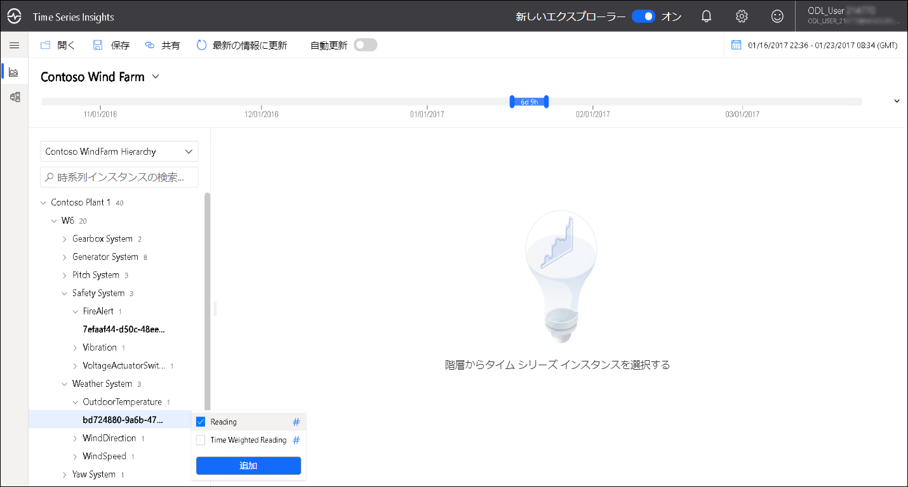

1. 折れ線グラフは、特定の期間に基づいたその平均温度値とともに表示されます。

1. **[間隔]** ドロップダウンから、間隔を変更してから、グラフに反映されている変更を監視します。

1. 作成した新しいメジャー内で [設定] (歯車アイコン) を選択し、**[Stepped Interpolation (ステップ補間の使用)]** および **[Min/Max Shadows (最小/最大シャドウ)]** の横のボックスを有効にします。

1. グラフは、これらの変更を反映するように更新されます。**[Show Min/Max (最小/最大の表示)]** が補間された線の後ろに影を作成して、最小および最大温度値を表示する方法に注目してください。これは、表示されている線が平均温度値であるためです。

1. 間隔サイズ スライダー ツールを使用して、同じ期間の間隔をズームインおよびズームアウトできます。スライダーを使用すると、ミリ秒単位の小さなスライスまでスムーズな傾向を表示する、時間の大きなスライス間の移動をより正確に制御できます。これにより、データの詳細で高解像度のカットを表示および分析できます。

   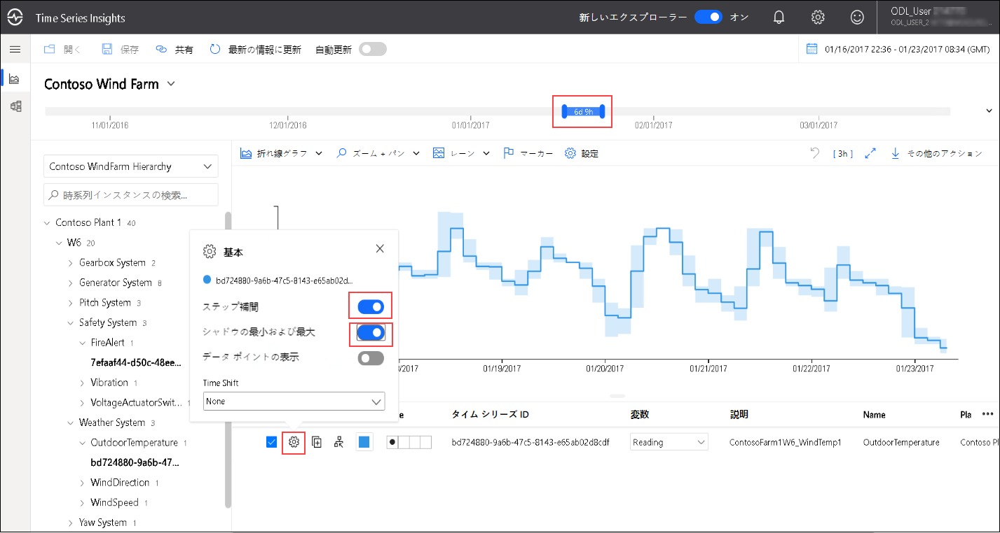

1. 環境の右上隅にある **[その他のアクション]** をクリックします。

1. ドロップダウンから、**[生イベントの探索]** を選択します。

   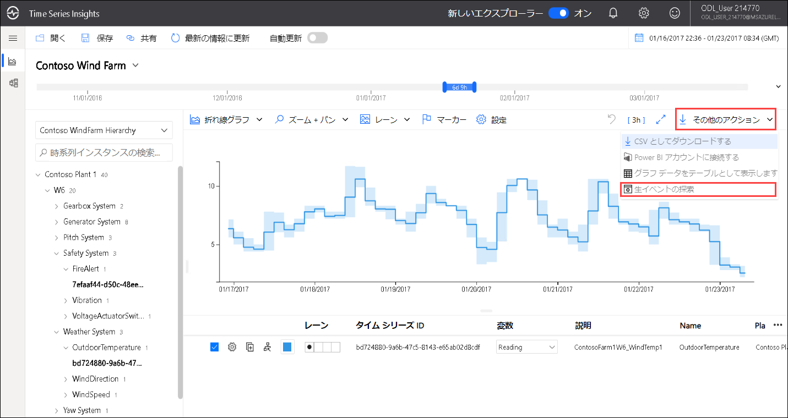

1. 見たい列だけを表示させることができます。その列を、イベント ダイアログの左下にある **[Download as CSV (CSV としてダウンロード)]** を選択してエクスポートできます。

   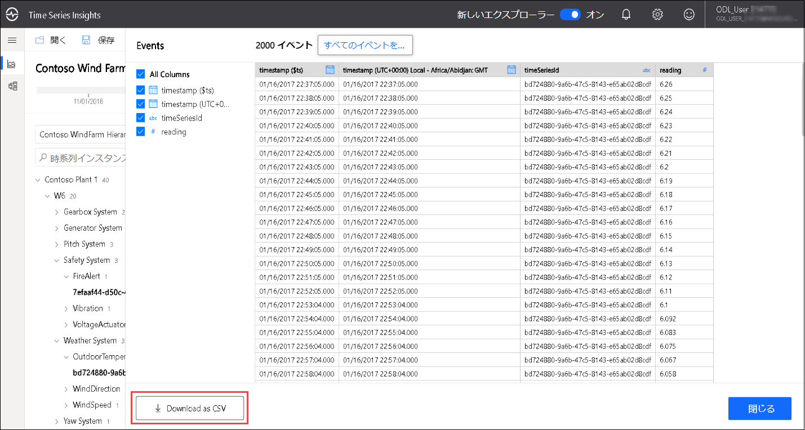
   
1. 次に、環境の右上隅にある **[その他のアクション]** をクリックし、**[グラフ データをテーブルとして表示します]** を選択します。
  
1. 特定の時間間隔の間の**最高温度**、**平均温度**、および**最低温度**で構成されるテーブルが表示されます。

   

   > **注**: ストリームアナリティクスジョブを **停止** し、IoT シミュレーターアプリへ進んでください。それから **テレメトリー停止** ボタンをクリックし、テレメトリーストリームの送信を停止してください。

この演習では、Stream Analytics ジョブが IoT Hub からテレメトリ メッセージをプルし、2 つの異なる宛先にメッセージを送信する方法を確認しました。1 つはすべてのメッセージを取得して Blob Storage に送信するクエリ (コールド パス) と、もう 1 つは Power BI の視覚化とレポートを使用してリアルタイムでレポートするために必要な重要なイベントのみを選択するクエリ (ホット パス) です。
