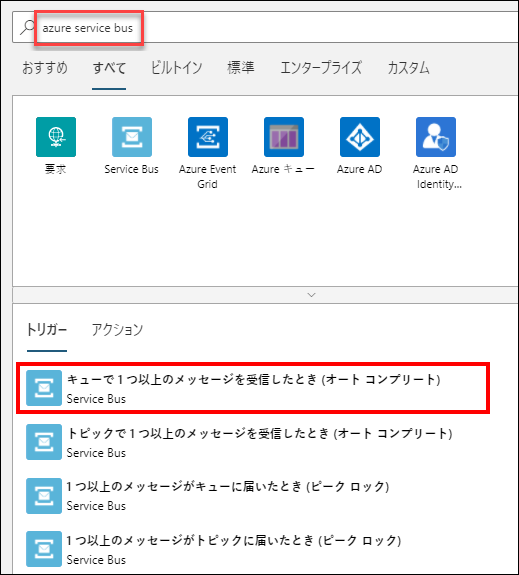
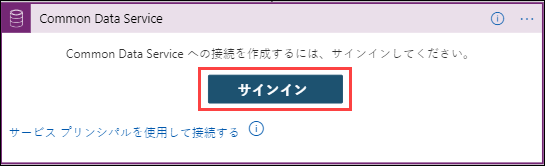

# 演習 3: Power BI を使用した IoT およびリアルタイム モニタリングでの Machine Learning

## シナリオ

今までは、生成された分析情報は、異常を検出するために手動での関与が必要でした。Fabrikam は、AI (人工知能) の分野におけるテクノロジーの進歩を利用して、温度データの異常を検出したいと考えています。  Fabrikam は、異常が検出された場合の自動アラートを構成し、異常情報を使用してデータ ストリームのリアルタイム監視を実行することも考えています。   

Machine Learning を使用して、手動による介入なしに異常を検出するようにソリューションを構成する必要があります。また、複数のディメンションにわたるデータ ストリームのリアルタイム監視を有効にし、異常が検出されたときには必ずチームに通知するようにアラートを構成する必要があります。

## 概要

この演習では、自動化された組み込み Machine Learning モデルを使用して、Turbine デバイスからのデータを分析し、異常を検出します。また、前の演習のクエリからの出力を使用して、Power BI ダッシュボードでリアルタイムデータを視覚化します。

この演習には次のタスクが含まれます。

* IoT Simulator アプリを使用して異常をトリガーする
* 組み込み Machine Learning モデルを使用して異常を検出する
* Power BI ダッシュボードを作成して異常データを視覚化する
* 異常が検出されたときには必ず通知するようにアラートを構成します [読み取り専用]

### タスク 1: IoT Simulator アプリを使用して異常をトリガーする

IoT Simulator アプリケーションには、デモ目的で異常をトリガーするオプションがあります。このタスクでは、この機能を使用します。

1. まだ実行されていない場合は、VM のデスクトップから **IoT Simulator アプリ**を起動します。Simulator が IoT Hub に接続され、テレメトリ データを送信していることを確認します。 

1. IoT Simulator アプリのダイアログで、横にある **[異常]** ボタンをクリックしてテレメトリを停止します。これにより、異常が IoT Hub に送信されます。

    > **注**: デバイスがテレメトリーを送信していない場合、IoT シミュレーターアプリを起動してテレメトリーを送信し、デバイスをシミュレーションしてください。
    
1. グリッドには、送信されたテレメトリ メッセージのリストが表示されます。シミュレートされた温度値を観察します。温度値が突然急上昇することがわかります。

### タスク 2: 組み込み Machine Learning モデルを使用して異常を検出する

このタスクでは、組み込みの ML モデルを使用して異常を検出します。

**組み込みの Machine Learning モデル** - AnomalyDetection_SpikeAndDip 関数は、スライディング ウィンドウを使用してデータの異常を分析します。スライディング ウィンドウは、たとえば、最新の 2 分間のテレメトリ データである場合があります。ウィンドウは、テレメトリの流れに合わせてほぼリアルタイムで進みます。より多くのデータを含めるためにスライディング ウィンドウのサイズを大きくすると、異常検出の精度も向上します (ただし、遅延も増加するため、適切なバランスを取る必要があります)。

1. リソース グループ タイルで、**iot-{deployment-id}** をクリックし、**iot-streamjob-{deployment-id}** という Stream Analytics ジョブを選択します。Stream Analytics ジョブが実行されている場合は停止してください。

   > **注**: 次のステップのクエリを編集する前に、ストリームアナリティクスジョブが **停止した** ことを確認してください。

1. 左側のメニューの **[ジョブ トポロジ]** で、**[クエリ]** をクリックします。

1. 次の SQL クエリをコピーして、既存のクエリに置き換えます。

    ```sql
     WITH AnomalyDetectionStep AS
     (
       SELECT
           EventProcessedUtcTime AS time,
           CAST(temp AS float) AS temp,
           AnomalyDetection_SpikeAndDip(CAST(temp AS float), 90, 120, 'spikesanddips')
               OVER(LIMIT DURATION(second, 120)) AS SpikeAndDipScores
       FROM iothubinput
    )
       SELECT
           time,
           temp,
           CAST(GetRecordPropertyValue(SpikeAndDipScores, 'Score') AS float) AS
           SpikeAndDipScore,
           CAST(GetRecordPropertyValue(SpikeAndDipScores, 'IsAnomaly') AS bigint) AS
           IsSpikeAndDipAnomaly
      INTO powerbioutput
      FROM AnomalyDetectionStep;
      
      SELECT * INTO bloboutput FROM iothubinput;
      
      SELECT AVG(temp) AS AverageTemperature, id INTO servicebusoutput FROM iothubinput GROUP BY TumblingWindow(minute, 1), id HAVING AVG(temp) > 72 ;
    ```

    > **注**:  このクエリのこの最初のセクションでは、温度データを取得し、過去 120 秒分を調べます。`AnomalyDetection_SpikeAndDip` 関数は、`Score` パラメーターと `IsAnomaly` パラメーターを返します。このスコアは、指定された値が異常であるとする ML モデルがどれほど確実であるかを示すもので、パーセントで示されます。スコアが 90% を超える場合、`IsAnomaly` パラメーターの値は 1 になります。そうでない場合、`IsAnomaly` の値は 0 になります。クエリの最初のセクションにある 120 と 90 のパラメーターに注目してください。クエリの 2 番目のセクションは、時間、温度、異常のパラメーターを `powerbioutput` に送信します。
 
    > **注**: クエリの 3 番目のセクション **SELECT AVG(temp) AS AverageTemperature, id INTO servicebusoutput FROM iothubinput GROUP BY TumblingWindow(minute, 1), id HAVING AVG(temp) > 72 ;** は、「iothubinput」入力に着信するイベントと、1 分のタンブリング期間別のグループを参照します。これは 72 を超える温度の平均と ID を「servicebusoutput」出力に送信します。`TumblingWindow` 関数の詳細については、次のリンクを参照してください。```https://docs.microsoft.com/en-us/stream-analytics-query/tumbling-window-azure-stream-analytics```

1. クエリ エディターに 1 つの入力と 3 つの出力が表示されることを確認します。

    * `入力`
      * `iothubinput`
    * `出力`
      * `bloboutput`
      * `powerbioutput`     
      * `servicebusoutput`

    それぞれが複数表示される場合は、クエリまたは入出力に使用した名前にタイプミスがある可能性があります。次に進む前に問題を修正してください。

1. クエリを保存するには、**[クエリを保存]** をクリックします。

1. 左側のメニューで、**[概要]** をクリックします。

1. ブレードの上部近くにある **[開始]** をクリックして、分析ジョブを開始します。

   > **注**: Stream Analytics ジョブが失敗した場合は、次の手順を実行します。
     *  [ジョブ トポロジ] で **[出力]** を選択し、**powerbioutput** を選択します
     * Power BI 出力ブレードで、[承認の更新] をクリックし、Azure 資格情報の入力を求められたら、[環境の詳細] タブから Azure ユーザー名とパスワードを入力し、[保存] をクリックします。

1. **[ジョブを開始]** ウィンドウの **[ジョブ出力の開始時刻]** で、**[今すぐ]** が選択されていることを確認してから、**[開始]** をクリックします。

このクエリからの出力を人間のオペレーターが簡単に解釈できるようにするには、データをわかりやすい方法で視覚化する必要があります。この視覚化を実行する 1 つの方法は、Power BI ダッシュボードを作成することです。これは次の演習で行います。

### タスク 3: Power BI ダッシュボードを作成して異常データを視覚化する

前のタスクでは、ML モデルを介してテレメトリを処理し、結果を Power BI に出力するように Stream Analytics ジョブを構成しました。Power BI 内で、結果を視覚化し、オペレーターの意思決定支援をするために、いくつかのタイルがあるダッシュボードを作成する必要があります。

データをリアルタイムで分析するために、Power BI のいくつかの組み込み機能と、Power BI のリアルタイム形式でデータを送信する Azure Stream Analytics の機能を使用します。

Power BI のダッシュボード機能を使用して、視覚化タイルを作成します。1 つのタイルには、平均温度測定値が含まれています。もう 1 つのタイルはゲージで、値が異常であるという信頼水準を 0.0 ～ 1.0 の数値で示します。3 番目のタイルでは、90% の信頼水準に達しているかどうかが示されます。最後に、4 番目のタイルは、過去 1 時間に検出された異常の数を示しています。このタイルでは、x 軸として時間を含めることにより、一連の異常が水平方向にクラスター化されるため、それらが短時間で検出されたかどうかが明確になります。

4 番目のタイルでは、異常を比較できます。

1. ブラウザーで、再び ```https://app.powerbi.com/``` に移動します。

1. Power BI が開いたら、左側のナビゲーション メニューで **[ワークスペース]** を展開し、**[マイ ワークスペース]** を選択します。

1. **[データセット]** タブで、**temperaturedataset** が表示されていることを確認します。
   
1. ワークスペース ページで、**[+ 新規]** をクリックし、ドロップダウンから **[ダッシュボード]** を選択します。

1. **[ダッシュボードを作成]** ポップアップで、**[ダッシュボード名]** の下に **Temperature Dash** と入力し、**[作成]** をクリックします。

    新しいダッシュボードは、基本的に空白のページとして表示されます。

1. 温度ゲージを追加するには、空白のダッシュボードの上部にある **[編集]** をクリックし、**[+ タイルの追加]** を選択します。

1. **[タイルの追加]** ウィンドウの **[リアルタイム データ]** の下で、**[カスタム ストリーミング データ]** をクリックし、**[次へ]** をクリックします。

1. **[カスタム ストリーミング データ タイルの追加]** ウィンドウの **[データセット]** の下で、**temperaturedataset** をクリックし、**[次へ]** をクリックします。

    ペインが再読み込みされ、視覚化の種類とフィールドを選択できるようになります。

1. **[視覚化タイプ]** で、ドロップダウンを開き、**[ゲージ]** をクリックします。

1. **[値]** の下で、**[+ 値の追加]** をクリックし、ドロップダウンを開いて、**temp** をクリックします。

    ゲージがダッシュボードにすぐに表示され、値の更新が開始されることに注目してください。

    
    
    > **注**:  **temp** がない場合は、IoT Simulator アプリが実行中であるか、Stream Analytics ジョブが実行されているかどうかを確認してください。また、異常の送信を 2 分間停止してから、再開して 3 ～ 5 分間待つこともできます。次に、ページを再読み込みして、値が表示されるかどうかを確認します。それでも表示されない場合は、デバイスを非アクティブ化して (必ずすべてのテレメトリ/異常の送信を停止してから、各デバイスの登録を解除して、デバイスを再度登録する)、IoT Simulator アプリに再接続します。登録したら、テレメトリを有効にして送信を開始します。
    
1. [タイルの詳細] ウィンドウを表示するには、**[次へ]** をクリックします。

1. **[タイルの詳細]** ウィンドウの **[タイトル]** の下に、**Temperature** と入力します。

1. 残りのフィールドは既定値のままにして、**[適用]** をクリックします。

    電話ビューの作成に関する通知が表示されても、無視してかまいません。通知はすぐに消えます (閉じることもできます)。

1. タイルのサイズを小さくするには、タイルの右下隅にマウスを置いてから、サイズ変更マウス ポインターをクリックしてドラッグします。

    タイルをできるだけ小さくします。さまざまなプリセットサイズにスナップします。

1. SpikeAndDipScore 集合横棒グラフを追加するには、ダッシュボードの上部にある **[編集]** をクリックし、**[+ タイルの追加]** を選択します。

    

1. **[タイルの追加]** ウィンドウの **[リアルタイム データ]** の下で、**[カスタム ストリーミング データ]** をクリックし、**[次へ]** をクリックします。

1. **[カスタム ストリーミング データ タイルの追加]** ウィンドウの **[データセット]** の下で、**temperaturedataset** をクリックし、**[次へ]** をクリックします。

   

1. **[視覚化タイプ]** で、ドロップダウンを開き、**[集合横棒グラフ]** をクリックします。

    視覚化タイプを変更すると、以下のフィールドが変更されることに注意してください。

1. **[値]** の下で、**[+ 値の追加]** をクリックし、ドロップダウンを開いて、**SpikeAndDipScore** をクリックします。

   

1. [タイルの詳細] ウィンドウを表示するには、**[次へ]** をクリックします。

1. **[タイルの詳細]** ウィンドウの **[タイトル]** の下に、**SpikeAndDipScore** と入力します。

1. [タイルの詳細] ウィンドウを閉じるには、**[適用]** をクリックします。

    電話ビューの作成に関する通知が表示されても、無視してかまいません。通知はすぐに消えます (閉じることもできます)。

1. ここでも、タイルのサイズを縮小し、できるだけ小さくします。

1. IsSpikeAndDipAnomaly カードの視覚化を追加するには、ダッシュボードの上部にある **[編集]** をクリックし、**[+ タイルの追加]** を選択します。

1. **[タイルの追加]** ウィンドウの **[リアルタイム データ]** の下で、**[カスタム ストリーミング データ]** をクリックし、**[次へ]** をクリックします。

1. **[カスタム ストリーミング データ タイルの追加]** ウィンドウの **[データセット]** の下で、**temperaturedataset** をクリックし、**[次へ]** をクリックします。

1. **[視覚化タイプ]** で、ドロップダウンを開き、**[カード]** をクリックします。

1. **[フィールド]** の下で、**[+ 値の追加]** をクリックし、ドロップダウンを開いて、**IsSpikeAndDipAnomaly** をクリックします。

1. [タイルの詳細] ウィンドウを表示するには、**[次へ]** をクリックします。

   

1. **[タイルの詳細]** ウィンドウの **[タイトル]** の下に、**Is Anomaly?** と入力します。

1. [タイルの詳細] ウィンドウを閉じるには、**[適用]** をクリックします。

    電話ビューの作成に関する通知が表示されても、無視してかまいません。通知はすぐに消えます (閉じることもできます)。

1. ここでも、タイルのサイズを縮小し、できるだけ小さくします。

1. ドラッグアンドドロップを使用して、ダッシュボードの左側にタイルを次の順序で垂直に配置します。

    * SpikeAndDipScore
    * Is Anomaly?
    * Temperature

1. ダッシュボードの上部にある **[編集]** をクリックし、**[+ タイルの追加]** を選択します。

1. **[タイルの追加]** ウィンドウの **[リアルタイム データ]** の下で、**[カスタム ストリーミング データ]** をクリックし、**[次へ]** をクリックします。

1. **[カスタム ストリーミング データ タイルの追加]** ウィンドウの **[データセット]** の下で、**temperaturedataset** をクリックし、**[次へ]** をクリックします。

    ペインが再読み込みされ、視覚化の種類とフィールドを選択できるようになります。

1. **[視覚化タイプ]** で、ドロップダウンを開き、**[集合横棒グラフ]** をクリックします。

    視覚化タイプを変更すると、以下のフィールドが変更されることに注意してください。

1. **[軸]** の下で、**[+ 値の追加]** をクリックし、ドロップダウンから **time** を選択します。

1. **[値]** の下で、**[+ 値の追加]** をクリックし、ドロップダウンから **IsSpikeAndDipAnomaly** を選択します。

1. **[表示する時間枠]** の下の **[最後]** の右側にあるドロップダウンを開き、**5** をクリックします。

    単位は **[分]** に設定したままにします。

1. [タイルの詳細] ウィンドウを表示するには、**[次へ]** をクリックします。

   

1. **[タイルの詳細]** ウィンドウの **[タイトル]** の下に、**Anomalies over the hour** と入力します。

1. [タイルの詳細] ウィンドウを閉じるには、**[適用]** をクリックします。

    電話ビューの作成に関する通知が表示されても、無視してかまいません。通知はすぐに消えます (閉じることもできます)。

1. 今回は、タイルを伸ばして、高さが左側の 3 つのタイルと一致し、幅がダッシュボードの残りのスペースに合うようにします。

    非常に多くのルートと接続で遅延が発生しますが、視覚化で Turbine 温度データが見え始めてくるはずです。

1. IoT Simulator アプリを実行しており、分析ジョブが実行されていることを確認します。

1. **IoT Simulator アプリ**で、タービン-01 の異常の送信を開始し、2 ～ 3 分間実行してから停止します。

1. 構成した Power BI ダッシュボードの変動を表示するために、ML モデルが開始する前に少なくとも 3 ～ 5 分間、ジョブをしばらく実行します。
    
1. これで、このようなアクティブな Power BI ダッシュボードが表示されるはずです。

   

   > **注**: ストリームアナリティクスジョブを **停止** し、IoT シミュレーターアプリへ進んでください。それから **異常を停止** ボタンを、次に **テレメトリー停止** ボタンをクリックし、各デバイスのテレメトリーストリームの送信を停止してください。

### タスク 4: 異常が検出されたときにアラートを受け取る [読み取り専用]

**** 
**提供されたラボ環境にはこのタスクを完了するために必要な D365 ライセンスがないため、これは読み取り専用タスクになります**。
****

このタスクでは、**Logic App** を **Service Bus キュー**によってトリガーされるように構成し、Dynamics 365 にレコードを追加します。デバイスの平均温度が特定の値を超えると、データは Stream Analytics から Service Bus キューに送信されます。

1. リソース グループ **iot-{deploymentid}** に移動し、Logic App **iot-logicapp-{deployment-id}** を選択します。

1. Logic Apps デザイナー ウィンドウから **[Blank Logic App +]** タイルを選択します。

1. 検索ボックスに、フィルターとして **"azure service bus"** を入力します。トリガー リストから、**[キューで 1 つ以上のメッセージを受信したとき (オート コンプリート)]** トリガーを選択します。

   
   
1. Logic App Designer から接続情報の入力を求められたら、次の手順に従います。

   * **iotservicebusconnection** のように、接続の名前を入力します。
   * 使用している **Service Bus 名前空間**を選択します。
   * Service Bus ポリシーを選択し、**[作成]** を選択します。

1. メッセージング エンティティ **iotqueue** を選択します。
    
1. 選択したトリガーに必要な情報を提供します。他の使用可能なプロパティをアクションに追加するには、[Add new parameter (新しいパラメーターを追加)] リストを開き、必要なプロパティを選択します。たとえば、キューをチェックするためのポーリング間隔と頻度を選択します。

1. アクションを追加する手順で、**[+ 新しいステップ]** を選択します。

1. **Data operations** と入力し、メニューから選択します。次に、**[JSON を解析]** アクションを選択します。

1. コンテンツ フィールドを選択し、次の式を入力します。
   **decodeBase64(Body()?[‘Content’])**
   
1. **[Use sample payload to generate schema (サンプル ペイロードを使用してスキーマを生成する)]** をクリックし、次の JSON サンプル ペイロードを貼り付けます。    

   **{"AverageTemperature":90,"id":"turbine-01"}**
   
1. コマンド バーの **[保存]** をクリックします。

  > 注: 次の手順では、Common Data Service である Logic App 用の Dynamics 365 コネクタを追加します。

1. プロセスで **[+ 新しいステップ]** をクリックし、**common data service** と入力し、**[Common Data Service]** を選択して、**[新しいレコードを作成する]** アクションを選択します。

   

   **注**: CloudLabs が提供する資格情報を使用して残りの手順を実行することはできませんが、残りの手順を実行してアラートの構成方法を理解することはできます。

1. **[サインイン]** をクリックして、Common Data Service への接続を作成します。

   

1. ドロップダウンから **環境** とエンティティ **Tasks** を選択します。

   
   
1. 次に、セクションの下部にある **[Add new parameter (新しいパラメーターを追加)]** をクリックして、[レコード作成日] を選択します。

1. **[Subject (サブジェクト)]** フィールドで、**Alert - Device {Dynamic Content id } at { Expression utcNow() }** を指定します。動的コンテンツと式の場合、式の解析 JSON および utcNow() 関数で使用可能な動的コンテンツから、識別子の値を選択する必要があります。

   

1. **[説明]** フィールドに、次のメッセージの内容を入力します。

    ```text
     Alert - Average Temperature for Device  @{Dynamic Content['id']} is  @{Dynamic Content['AverageTemperature']}
    ```

1. 次に、[Record created on (レコード作成日付)] フィールドに対して動的式 utcNow() を追加します。

   
    
1. Logic App が適切に構成され、トリガーが発生すると、Dynamics 365 タスクにエントリが表示されます。

    > **注**:  Logic App Designer を調べ、変更を**保存**せずに次の演習に進みます。
    
この演習では、組み込み Machine Learning モデルを使用して、Turbine デバイスからのデータを分析する方法と、検出された異常を Power BI ダッシュボードで視覚化する方法について学習しました。また、Logic App を使用して、Service Bus ベースのトリガーで D365 にアラート チケットを追加する方法についても学習しました。
