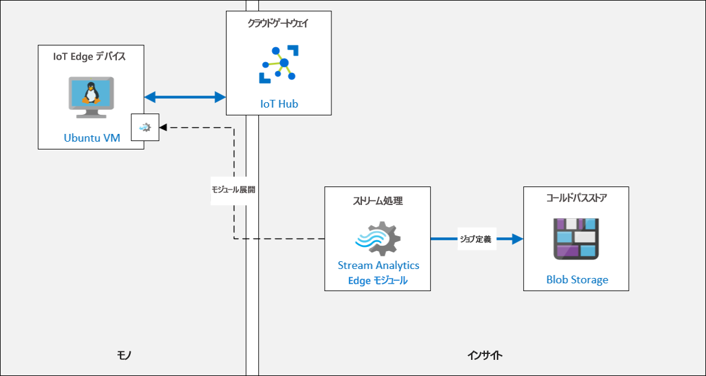
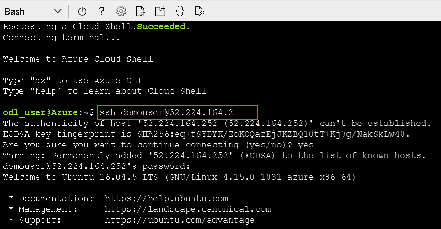

# 演習 4: Azure IoT Edge を使い始める

## シナリオ

膨大な数のデバイスがデプロイされており、大量のデータが収集されてクラウドに送信されています。Edge にインテリジェンスを導入することは可能ですか?

Fabrikam, Inc. は、IoT Edge ゲートウェイ デバイスを使用して、即座に処理するためにインテリジェンスの一部をエッジに導入したいと考えています。データの一部は引き続きクラウドに送信されます。さらに、データ インテリジェンスを IoT Edge に導入することで、ローカル ネットワークが貧弱な場合でも、データを処理して迅速に対応できるようになります。

これまでに、Azure IoT Edge ソリューションのプロトタイピングを行ってこられたことでしょう。まず、Stream Analytics モジュールをデバイスにデプロイします。このモジュールを使用して、平均温度を計算し、プロセス制御値を超えた場合にアラート通知を生成します。

## 概要

この演習では、Stream Analytics モジュールを Edge デバイスにデプロイし、プロセス制御値を超えた場合にアラート通知が生成されるように設定します。このラボの目的に応じて、IoT Edge デバイスとして構成された、作成済み Linux ベースの Azure VM が提供されます。

この演習の一環として、次のタスクを実行します。

* IoT Edge VM に接続する
* Edge モジュールを Edge デバイスに追加する
* Azure Stream Analytics Edge モジュールを Edge デバイスにデプロイする

Azure IoT Edge は、クラウドで実行されるクラウド サービスと、デバイスで実行されるランタイムの組み合わせです。ランタイムが始動し、デバイス上のワークフローを管理します。ワークフローは、特定の順序でリンクしてエンドツーエンドのシナリオを作成する一連のコンテナーで構成されます。IoT Edge は IoT Hub によって管理されます。Azure IoT Edge を使用すると、クラウド サービスを使用して開発されたエッジ デバイスでワークロードを実行できます。ワークロードは、Docker 互換コンテナーを使用してデプロイされたモジュールです。モジュールは、人工知能アプリケーション、Azure およびサードパーティのサービス、またはビジネス ロジックである可能性があります。詳しい IoT Edge の説明については、次のリンクに移動できます。```https://docs.microsoft.com/en-us/azure/iot-edge/about-iot-edge```

## ソリューション アーキテクチャ
 
  

### タスク 1: IoT Edge VM に接続する

このタスクでは、IoT Edge VM に接続し、Azure IoT Edge がデバイスで実行されているかどうかを確認します。

1. Azure Portal メニューで、**[リソース グループ]** をクリックします。
 
1. **iot-{deployment-id}** リソース グループから、IoT Edge 仮想マシン **linuxagentvm-{deployment-id}** をクリックします。

1. **[概要]** ウィンドウの上部にある **[接続]** をクリックしてから、**[SSH]** をクリックします。

1. **[接続]** ペインの **[4.以下のサンプル コマンドを実行して VM に接続]** の下にあるサンプル コマンドをコピーします。

    これは、VM の IP アドレスと管理者ユーザー名を含む仮想マシンに接続するために使用できるサンプル SSH コマンドです。コマンドは、`ssh demouser@52.170.205.79` と同様にフォーマットする必要があります。

    > **注**: コピーしたサンプル コマンドには、**-i <private key path>** が含まれています。テキスト エディターを使用してコマンドのその部分を削除してから、更新されたコマンドをクリップボードにコピーします。
 
1. **```https://shell.azure.com```** に移動して Azure Cloud Shellを開き、**Bash** を選択します。

1. **[詳細設定を表示]** をクリックして、次の詳細を入力します。

   * リソース グループ : **[既存のものを使用]** -> **iot-{deployment-id}** を選択します
   * ストレージ アカウント: **[新規作成]** を選択し、**cloudstore{deployment-id}** と入力します
   * ファイル共有: **[新規作成]** を選択し、**blob** と入力します
   
     >   **注**: - [環境の詳細] ページから **deployment-id** の詳細を取得できます。
        
   

1. Azure Cloud Shell のコマンド プロンプトで、更新した `ssh` コマンドをテキスト エディターに貼り付けて、**Enter** キーを押します。

1. **Are you sure you want to continue connecting?** というメッセージが表示されたら、`yes` と入力し、**Enter** キーを押します。

1. パスワードの入力を求められたら、**Password.1!!** と入力し、**Enter** キーを押します。

   

1. 接続すると、ターミナルのコマンド プロンプトが変わり、Linux VM の名前が次のように表示されます。

    ```cmd/sh
    demouser@linuxagentvm-{deployment-id}:~$
    ```

    これにより、接続している VM がわかります。

    > **重要:**接続すると、Edge VM の未適用の OS アップデートについての通知を受け取る可能性があります。  このことはラボの目的に応じて無視していますが、実稼働環境では、Edge デバイスを常に最新の状態に保つ必要があります。

1. Azure IoT Edge ランタイムが VM にインストールされていることを確認するには、次のコマンドを実行します。

    ```cmd/sh
    iotedge version
    ```

    このコマンドは、仮想マシンに現在インストールされている Azure IoT Edge ランタイムのバージョンを出力します。
    IoT Edge デバイスには、IoT Edge ランタイムがインストールされています。IoT Edge ランタイムは、デバイスを IoT Edge デバイスに変えるプログラムのコレクションです。IoT Edge ランタイム コンポーネントにより、集合的に、IoT Edge デバイスはエッジで実行するコードを受信して、結果を IoT Hub と通信できます。

### タスク 2: Edge モジュールを Edge デバイスに追加する

この演習では、Simulated Temperature Sensor をカスタム IoT Edge モジュールとして追加し、それを展開して IoT Edge デバイスで実行します。

IoT Edge モジュールは、コンテナーとして実装される実行可能パッケージです。

IoT Edge モジュールから、クラウド ワークロードをデプロイして、IoT デバイスで直接実行できます。IoT Edge モジュールは、IoT Edge によって管理される最小の計算単位です。IoT Edge モジュールを使用すると、クラウドではなくデバイス上のデータを分析できます。ワークロードの一部をエッジに移動することで、デバイスはクラウドへのメッセージの送信に費やす時間を短縮し、イベントにより迅速に対応できます。

1. 必要に応じて、Azure アカウントの資格情報を使用して Azure Portal にログインします。
 
1. [リソース] グループ タイルで、IoT Hub を開くには、**iothub-{deployment-id}** をクリックします。

1. **IoT Hub** ブレードの左側にある **[Automatic Device Management (自動デバイス管理)]** の下で、**[IoT Edge]** をクリックします。

1. IoT Edge デバイスのリストで、**turbine-06** をクリックします。

1. **turbine-06** ブレードで、**[モジュール]** タブにデバイス用に現在構成されているモジュールのリストが表示されていることに注意してください。

    現在、IoT Edge デバイスは、IoT Edge ランタイムの一部である Edge エージェント (`$edgeAgent`) モジュールと Edge Hub (`$edgeHub`) モジュールのみで構成されています。

1. **turbine-06** ブレードの上部にある **[モジュールを設定]** をクリックします。

1. **[Set modules on device: turbine-06]** ブレードで、**IoT Edge Modules** セクションを見つけます。

1. **[IoT Edge モジュール]** の下で、**[追加]** をクリックしてから、**[IoT Edge モジュール]** をクリックします。

1. **[Add IoT Edge Module]** ウィンドウの **[IoT Edge Module Name]** の下に、**turbinesensor** と入力します

    カスタム モジュールに「turbinesensor」という名前を付けます

1. **[イメージ URI]** で、**asaedgedockerhubtest/asa-edge-test-module:simulated-temperature-sensor** と入力します。

    > **注**: このイメージは、このテスト シナリオをサポートするために製品グループによって提供された Docker Hub 上の公開イメージです。

1. 選択したタブを変更するには、**[Module Twin Settings (モジュール ツイン設定)]** をクリックします。

1. モジュール ツインに必要なプロパティを指定するには、次の JSON を入力します。

    ```json
    {
        "EnableProtobufSerializer": false,
        "EventGeneratingSettings": {
            "IntervalMilliSec": 500,
            "PercentageChange": 2,
            "SpikeFactor": 2,
            "StartValue": 68,
            "SpikeFrequency": 20
        }
    }
    ```

    この JSON は、モジュール ツインの目的のプロパティを設定することで Edge モジュールを構成します。

1. ブレードの下部にある **[追加]** をクリックします。

1. **[Set modules on device: turbine-06]** ブレードの下部にある **[Next: Routes >]** をクリックします。

1. 既定ルートがすでに設定されていることに注目してください。

    * 名前: **route**
    * 値: `FROM /messages/* INTO $upstream`

    このルートは、IoT Edge デバイス上のすべてのモジュールから IoT Hub にすべてのメッセージを送信します

1. **[Review + create]** をクリックします。

1. **[Deployment]** で、表示されたデプロイ マニフェストを少しの時間を取って確認します。 

    ご覧のとおり、IoT Edge デバイスのデプロイ マニフェストは JSON としてフォーマットされているため、非常に読みやすくなっています。

    `properties.desired` セクションの下には、IoT Edge デバイスにデプロイされる IoT Edge モジュールを宣言する `modules` セクションがあります。これには、コンテナー レジストリの資格情報を含むすべてのモジュールのイメージ URI が含まれます。

    ```json
    {
        "modulesContent": {
            "$edgeAgent": {
                "properties.desired": {
                    "modules": {
                        "turbinesensor": {
                            "settings": {
                                "image": "asaedgedockerhubtest/asa-edge-test-module:simulated-temperature-sensor",
                                "createOptions": ""
                            },
                            "type": "docker",
                            "version": "1.0",
                            "status": "running",
                            "restartPolicy": "always"
                        },
    ```

    JSON の下部には、Edge Hub に必要なプロパティを含む **$edgeHub** セクションがあります。このセクションには、モジュール間および IoT Hub へのイベントのルーティングのためのルーティング構成も含まれています。

    ```json
        "$edgeHub": {
            "properties.desired": {
                "routes": {
                  "route": "FROM /messages/* INTO $upstream"
                },
                "schemaVersion": "1.0",
                "storeAndForwardConfiguration": {
                    "timeToLiveSecs": 7200
                }
            }
        },
    ```

    JSON のさらに下には、**turbinesensor** モジュールのセクションがあります。ここで、`properties.desired` セクションには、Edge モジュールの構成に必要なプロパティが含まれています。

    ```json
                },
                "turbinesensor": {
                    "properties.desired": {
                        "EnableProtobufSerializer": false,
                        "EventGeneratingSettings": {
                            "IntervalMilliSec": 500,
                            "PercentageChange": 2,
                            "SpikeFactor": 2,
                            "StartValue": 68,
                            "SpikeFrequency": 20
                        }
                    }
                }
            }
        }
    ```

1. デバイスのモジュールの設定を終了するには、ブレードの下部にある **[作成]** をクリックします。

1. **turbine-06** ブレードの **[Modules]** の下で、**turbinesensor** がリストされるようになったことに注目してください。

    > **注**: 初めてリストされたモジュールを表示するには、**[再読み込み]** をクリックする必要がある場合があります。

    **turbinesensor** の RUNTIME STATUS が報告されていないことに気付く場合があります。

1. ブレードの上部で、**[再読み込み]** をクリックします。

1. **turbinesensor** モジュールの **RUNTIME STATUS** が **running** に設定されていることに注目してください。

    それでも値が報告されない場合は、しばらく待ってから、ブレードを再度、再読み込みしてください。
 
1. Cloud Shell セッションを開きます (まだ開いていない場合)。

    `vm-iot-edge-{deployment-id}` 仮想マシンに接続しなくなった場合は、以前と同様に **SSH** を使用して接続します。

1. Cloud Shell コマンド プロンプトで、IoT Edge デバイスで現在実行しているモジュールをリストするには、次のコマンドを入力します。

    ```cmd/sh
    iotedge list
    ```

1. コマンドの出力は次のようになります。 

    ```cmd/sh
    demouser@linuxagentvm-{deployment-id}:~$ iotedge list
    NAME             STATUS           DESCRIPTION      CONFIG
    edgeHub          running          Up a minute      mcr.microsoft.com/azureiotedge-hub:1.0
    edgeAgent        running          Up 26 minutes    mcr.microsoft.com/azureiotedge-agent:1.0
    turbinesensor    running          Up 34 seconds    asaedgedockerhubtest/asa-edge-test-module:simulated-temperature-sensor
    ```

    実行中のモジュールの 1 つとして `turbinesensor` がリストされていることに注目してください。

1. モジュール ログを表示するには、次のコマンドを入力します。

    ```cmd/sh
    iotedge logs turbinesensor
    ```

    コマンドの出力は次のようになります。

    ```cmd/sh
    demouser@linuxagentvm-{deployment-id}:~$ iotedge logs turbinesensor
    11/14/2019 18:05:02 - Send Json Event : {"machine":{"temperature":41.199999999999925,"pressure":1.0182182583425192},"ambient":{"temperature":21.460937846433808,"humidity":25},"timeCreated":"2019-11-14T18:05:02.8765526Z"}
    11/14/2019 18:05:03 - Send Json Event : {"machine":{"temperature":41.599999999999923,"pressure":1.0185790159334602},"ambient":{"temperature":20.51992724976499,"humidity":26},"timeCreated":"2019-11-14T18:05:03.3789786Z"}
    11/14/2019 18:05:03 - Send Json Event : {"machine":{"temperature":41.999999999999922,"pressure":1.0189397735244012},"ambient":{"temperature":20.715225311096397,"humidity":26},"timeCreated":"2019-11-14T18:05:03.8811372Z"}
    ```

    任意の Edge モジュールのモジュール ログを表示するには、`iotedge logs` コマンドを使用できます。

1. Simulated Temperature Sensor モジュールは、500 個のメッセージを送信した後に停止します。次のコマンドを実行すると、再起動できます。

    ```cmd/sh
    iotedge restart turbinesensor
    ```

    今すぐモジュールを再起動する必要はありませんが、後でテレメトリの送信が停止した場合は、Cloud Shell に戻り、Edge VM に SSH で接続し、このコマンドを実行してリセットします。リセットされると、モジュールはテレメトリの送信を再開します。

### タスク 3: Azure Stream Analytics Edge モジュールを IoT Edge モジュールとしてデプロイする

**turbinesensor** モジュールが IoT Edge デバイスにデプロイされて実行されたので、IoT Hub に送信する前に、IoT Edge デバイス自体でメッセージを処理できる Stream Analytics モジュールを追加できます。

#### Stream Analytics ジョブを確認する

1. リソース グループ タイルで、**iot-{deployment-id}** をクリックし、**iotedge-streamjob-{deployment-id}** という Stream Analytics ジョブを選択します。

1. 次に、ブレードの左側にある **[ジョブ トポロジ]** で、**[入力]** を選択し、1 つの入力ジョブ **temperature** がすでに定義されていることを確認します。

1. 次に、**[ジョブ トポロジ]** の下の **[出力]** を選択し、1 つの出力ジョブ **alert** がすでに定義されていることを確認します。

1. 左側のナビゲーション メニューの **[構成]** で、[Storage account settings (ストレージ アカウントの設定)] をクリックします。iotstorage{deployment-id} ストレージ アカウントが追加されていることを確認します。

#### Stream Analytics ジョブをデプロイする

1. Azure Portal で、**iothub-{deployment-id}** IoT Hub リソースに移動します。

1. 左側のナビゲーション メニューの **[Automatic Device Management (自動デバイス管理)]** で、**[IoT Edge]** をクリックします。

1. **[デバイス ID]** の下で、**turbine-06** をクリックします。

1. **turbine-06** ウィンドウの上部にある **[モジュールを設定]** をクリックします。

1. **[Set modules on device: turbine-06]** ウィンドウで、**IoT Edge Modules** セクションを見つけます。

1. **[IoT Edge モジュール]** の下で、**[追加]** をクリックしてから、**[Azure Stream Analytics モジュール]** をクリックします。

1. **[Edge deployment]** ウィンドウの **[Subscription]** の下で、このコースに使用しているサブスクリプションが選択されていることを確認します。

1. **[Edge job (Edge ジョブ)]** ドロップダウンで、**iotedge-streamjob-{deployment-id}** Steam Analytics ジョブが選択されていることを確認します。

    > **注**: ジョブはすでに選択されている可能性がありますが、**[保存]** ボタンは無効になっています。**[Edge job (Edge ジョブ)]** ドロップダウンをもう一度開き、**iotedge-streamjob-{deployment-id}** ジョブをもう一度選択します。次に、**[保存]** ボタンが有効になります。

1. ウィンドウの下部にある **[保存]** をクリックします。

    デプロイには少し時間がかかる場合があります。

1. **[Set modules on device: turbine-06]** ブレードの下部にある、**[Review + create]** をクリックします。

1. **[Review + create]**タブで、**Deployment Manifest** JSONが、構成されたばかりの Stream Analytics モジュールとルーティング定義で更新されていることに注目してください。

1. ブレードの下部にある **[作成]** をクリックします。

1. Edge パッケージが正常に公開されたら、新しい ASA モジュールが **[IoT Edge モジュール]** セクションの下にリストされていることに注目してください。

1. **[IoT Edge モジュール]** の下で、**iotedge-streamjob-{deployment-id}** をクリックします。

    これは、Edge デバイスに追加されたばかりの Steam Analytics モジュールです。

1. **[Update IoT Edge Module]** ウィンドウで、**[Image URI]** が標準の Azure Stream Analytics イメージを指していることに注意してください。

    ```text
    mcr.microsoft.com/azure-stream-analytics/azureiotedge:1.0.7
    ```

    これは、IoT Edge デバイスにデプロイされるすべての ASA ジョブに使用されるのと同じイメージです。

    > **注**:  構成されている **[イメージ URI]** の末尾にあるバージョン番号は、Stream Analytics モジュールを作成した時点での現行最新バージョンを反映します。

1. すべての値をデフォルトのままにして、**[IoT Edge Custom Modules]** ウィンドウを閉じます。

1. **[Set modules on device: turbine-06]**ウィンドウで、**[Next: Routes >]** をクリックします。

    既存のルーティングが表示されていることに注意してください。

1. 定義されている既定のルートを次の 3 つのルートに置き換えます。
   
   > **注**: 必ず `iotstreamjob-edge-{deployment-id}` プレースホルダーを Azure Stream Analytics ジョブ モジュールの名前に置き換えてください。
   
    * ルート 1
        * 名前: **telemetryToCloud**
        * 値: `FROM /messages/modules/turbinesensor/* INTO $upstream`
    * ルート 2
        * 名前: **alertsToReset**
        * 値: `/messages/modules/iotedge-streamjob-{deployment-id}/* から BrokeredEndpoint("/modules/turbinesensor/inputs/control")` へ
    * ルート 3
        * 名前: **telemetryToAsa**
        * 値: `/messages/modules/turbinesensor/* から BrokeredEndpoint("/modules/iotedge-streamjob-{deployment-id}/inputs/temperature")` へ

    > **注**: **[前へ]** をクリックしてモジュールとその名前のリストを表示し、**[次へ]** をクリックしてこの手順に戻ることができます。

    定義されているルートは次のとおりです。

    * **telemetryToCloud** ルートは、`turbinesensor` モジュール出力からのすべてのメッセージを Azure IoT Hub に送信します。
    * **alertsToReset** ルートは、Stream Analytics モジュール出力からのすべてのアラート メッセージを **turbinesensor** モジュールの入力に送信します。
    * **telemetryToAsa** ルートは、`turbinesensor` モジュール出力からのすべてのメッセージを Stream Analytics モジュール入力に送信します。

1. **[Set modules on device: turbine-06]** ブレードの下部にある、**[Review + create]** をクリックします。

1. **[Review + create]**タブで、**Deployment Manifest** JSONが、構成されたばかりの Stream Analytics モジュールとルーティング定義で更新されていることに注目してください。

1. `turbinesensor` Simulated Temperature Sensor モジュールの JSON 構成に注目してください。

    ```json
    "turbinesensor": {
        "settings": {
            "image": "asaedgedockerhubtest/asa-edge-test-module:simulated-temperature-sensor",
            "createOptions": ""
        },
        "type": "docker",
        "version": "1.0",
        "status": "running",
        "restartPolicy": "always"
    },
    ```

1. 以前に構成されたルートの JSON 構成と、JSON デプロイ定義でそれらがどのように構成されているかに注目してください。

    ```json
    "$edgeHub": {
        "properties.desired": {
            "routes": {
                "telemetryToCloud": "FROM /messages/modules/turbinesensor/* INTO $upstream",
                "alertsToReset": "FROM /messages/modules/iotedge-streamjob-{deployment-id}/* INTO BrokeredEndpoint(\\\"/modules/turbinesensor/inputs/control\\\")",
                "telemetryToAsa": "FROM /messages/modules/turbinesensor/* INTO BrokeredEndpoint(\\\"/modules/iotedge-streamjob-{deployment-id}/inputs/temperature\\\")"
            },
            "schemaVersion": "1.0",
            "storeAndForwardConfiguration": {
                "timeToLiveSecs": 7200
            }
        }
    },
    ```

1. ブレードの下部にある **[作成]** をクリックします。

#### データを見る

1. **SSH** を介して **IoT Edge デバイス**に接続している **Cloud Shell** セッションに戻ります。  

    > **注**: 接続が閉じているかタイムアウトした場合は、再接続します。`SSH` コマンドを実行し、前と同じようにログインします。

1. コマンド プロンプトで、デバイスにデプロイされているモジュールのリストを表示するには、次のコマンドを入力します。

    ```cmd/sh
    iotedge list
    ```

    新しい Stream Analytics モジュールの IoT Edge デバイスへのデプロイには、少しの時間がかかる場合があります。展開されたら、このコマンドによって出力されるリストに表示されます。

    ```cmd/sh
    demouser@linuxagentvm-{deployment-id}:~$ iotedge list
    NAME                       STATUS           DESCRIPTION      CONFIG
    iotedge-streamjob-232539   running          Up a minute      mcr.microsoft.com/azure-stream-analytics/azureiotedge:1.0.5
    edgeAgent                  running          Up 6 hours       mcr.microsoft.com/azureiotedge-agent:1.0
    edgeHub                    running          Up 4 hours       mcr.microsoft.com/azureiotedge-hub:1.0
    turbinesensor              running          Up 4 hours       asaedgedockerhubtest/asa-edge-test-module:simulated-temperature-sensor
    ``` 

    > **注**:  Stream Analytics モジュールがリストに表示されない場合は、1 ～ 2 分待ってからもう一度試してください。モジュールのデプロイが IoT Edge デバイスで更新されるには、少しの時間がかかる場合があります。

1. `turbinesensor` モジュールによって Edge デバイスから送信されるテレメトリを監視するには、コマンド プロンプトで次のコマンドを入力します。

    ```cmd/sh
    iotedge logs turbinesensor
    ```

1. 少し時間を取って出力を観察します。
 
    このイベントの出力は次のようになります。

    ```cmd/sh
    11/14/2019 22:26:44 - Send Json Event : {"machine":{"temperature":231.599999999999959,"pressure":1.0095600761599359},"ambient":{"temperature":21.430643635304012,"humidity":24},"timeCreated":"2019-11-14T22:26:44.7904425Z"}
    11/14/2019 22:26:45 - Send Json Event : {"machine":{"temperature":531.999999999999957,"pressure":1.0099208337508767},"ambient":{"temperature":20.569532965342297,"humidity":25},"timeCreated":"2019-11-14T22:26:45.2901801Z"}
    Received message
    Received message Body: [{"command":"reset"}]
    Received message MetaData: {"MessageId":null,"To":null,"ExpiryTimeUtc":"0001-01-01T00:00:00","CorrelationId":null,"SequenceNumber":0,"LockToken":"e0e778b5-60ff-4e5d-93a4-ba5295b995941","EnqueuedTimeUtc":"0001-01-01T00:00:00","DeliveryCount":0,"UserId":null,"MessageSchema":null,"CreationTimeUtc":"0001-01-01T00:00:00","ContentType":"application/json","InputName":"control","ConnectionDeviceId":"turbine-06","ConnectionModuleId":"vm-iot-edge-CP1119","ContentEncoding":"utf-8","Properties":{},"BodyStream":{"CanRead":true,"CanSeek":false,"CanWrite":false,"CanTimeout":false}}
    Resetting temperature sensor..
    11/14/2019 22:26:45 - Send Json Event : {"machine":{"temperature":320.4,"pressure":0.99945886361358849},"ambient":{"temperature":20.940019742324957,"humidity":26},"timeCreated":"2019-11-14T22:26:45.7931201Z"}
    ```
 
1. **turbinesensor** によって送信される温度テレメトリを監視しているときに、`machine.temperature` が平均で `72` を超えると、Stream Analytics ジョブによって **reset** コマンドが送信されることに注意してください。これは、Stream Analytics ジョブ クエリで設定されたアクションです。

この演習では、Azure IoT Edge サービスを利用して Edge デバイスでメッセージを処理しました。
