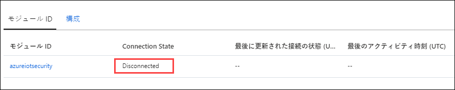
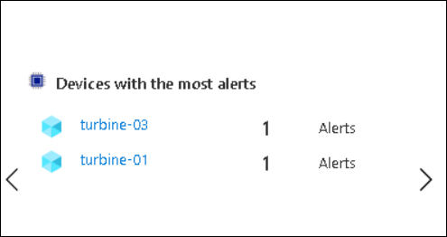

# 演習 5: IoT の保護	

## シナリオ

IoT ソリューションの展開に伴い、CTO は全体的なセキュリティ、特に STRIDE の脅威 (ユーザー ID のなりすまし、改ざん、否認、情報漏えい、サービス拒否、特権の昇格) について懸念しています。

ソリューションがエンドツーエンドで安全であることをどのように確認できますか?


## 概要

この演習では、次のアクティビティを実行します。

* Azure Security Center for IoT を有効にする
* セキュリティ モジュール ツインを作成する
* Linux マシン上に Security Center のエージェントをインストールする
* 監視するリソースを構成する
* カスタム アラートを作成する
* Azure Security Center でアラートを確認する

## 手順

### タスク 1: Azure Security Center for IoT Hub を有効にする

Azure Security Center for IoT を使用すると、セキュリティ管理を統合し、ハイブリッド クラウド ワークロードと Azure IoT ソリューション全体でエンドツーエンドの脅威検出と分析ができます。次のリンクから、Azure Security Center for IoT の詳細を確認できます。```https://docs.microsoft.com/en-us/azure/asc-for-iot/overview``` 

Azure Security Center for IoT は、既存の IoT デバイス管理プラットフォームと完全に統合し、デバイスのセキュリティ ステータスを管理したり、既存のデバイス制御機能を利用したりできるようになります。


このタスクでは、IoT Hub に対して **Azure Security Center for IoT** を有効にします。 

1. リソース グループ タイルで、**iot-{deployment-id}** をクリックし、**iothub-{deployment-id}** という名前の既存の IoT Hub を選択します。

1. 左側のメニューの **[セキュリティ]** で、**[概要]** をクリックします。

    Azure Security Center for IoT Hub は、セキュリティ ウィンドウを初めて開いたときにオンボードになります。 

1. **[Secure your IoT solution (IoT ソリューションを保護する)]** ボタンが表示された場合は、**[Secure your IoT solution (IoT ソリューションを保護する)]** をクリックし、プロンプトが表示されたらブラウザー ウィンドウを再読み込みします。

   

1. 変更を有効にするには、いったんログアウトし、```https://portal.azure.com``` に再度ログインしてください。

   > **注**: ログアウトする前の、アクセス許可が不十分であることに関連する警告は無視してかまいません。再度ログインするとアクセス許可が伝達されるからです。

1. IoT Hub に戻り、左側のメニューの **[セキュリティ]** の下にある **[概要]** を選択します。

1. 少し時間を取って、**[セキュリティの概要]** ウィンドウの内容を確認します。

    > **注**: Azure Security Center for IoT をオンボードにするとただちに脅威が検出されるわけではありません。このラボの終了前に、この [概要] ウィンドウに、報告される脅威の検出が表示されるようになります。 

#### ログ分析の作成

Azure Security Center for IoT をオンにすると、既定の Azure Log Analytics ワークスペースが作成され、IoT デバイス、IoT Edge、IoT Hub などの未加工のセキュリティ イベント、アラート、推奨事項が保存されます。

Log Analytics ワークスペースは、Azure Monitor ログ データ用の独自の環境です。各ワークスペースには独自のデータ リポジトリと構成があり、データ ソースとソリューションは特定のワークスペースにデータを格納するように構成されています。データを格納するには、Security Center 用の Azure Log Analytics が必要です。

このタスクでは、Azure Security Center のログ分析ワークスペースを作成します。

1. IoT Hub の [セキュリティの概要] ウィンドウを開きます。

1. 左側のメニューの **[セキュリティ]** で、セキュリティ設定を表示するには、**[設定]** をクリックします。 

    **[設定ページ]** ブレードが開き、**[名前]** の下に **[データ収集]** オプションが表示されます。
    
1. **[データ収集]** を選択し、表示された設定情報を少しの時間を取って確認します。
   
   

    > **注**: Log Analytics ワークスペース用に定義されている **[ワークスペース構成]** に注目してください。既定では、Azure Security Center for IoT ソリューションをオンにすると、Azure サブスクリプションの下にあるすべての IoT Hub が自動的に保護されます。Log Analytics ワークスペースが表示されるまでには、時間がかかる場合があります。

1. Log Analytics ワークスペースがまだ構成されていない場合は、**[ワークスペース構成]** の下の **[新しいワークスペースを作成]** をクリックします。

1. **[Log Analytics ワークスペース]** ウィンドウで、**iotworkspace-{deployment-id}** のような一意の名前を指定し、残りを既定のままにして、**[OK]** をクリックします。

1. デプロイが成功したら、**[ワークスペース]** のドロップダウンから、作成したばかりのワークスペースを選択します。

1. **[保存]** をクリックして、データ収集構成を保存します。

### タスク 2: セキュリティ モジュール ツインを作成する

デバイス ツインは、メタデータ、構成、条件などのデバイス状態情報を格納する JSON ドキュメントです。Azure IoT Hub は、IoT Hub に接続するデバイスごとにデバイス ツインを維持します。デバイス ツインついて詳しくは、こちらをご覧ください。```https://docs.microsoft.com/en-us/azure/iot-hub/iot-hub-devguide-device-twins```

デバイス ツインと同様に、モジュール ツインは、メタデータ、構成、条件などのモジュール状態情報を格納する JSON ドキュメントです。Azure IoT Hub は、IoT Hub に接続するモジュールごとにモジュール ツインを維持します。モジュール ツインについて詳しくは、こちらをご覧ください。```https://docs.microsoft.com/en-us/azure/iot-hub/iot-hub-devguide-module-twins```

Azure Security Center for IoT は、モジュール ツイン メカニズムを利用し、デバイスごとに「azureiotsecurity」という名前のセキュリティ モジュール ツインを維持します。セキュリティ モジュール ツインは、各デバイスのデバイス セキュリティに関連するすべての情報を保持します。Azure Security Center for IoT 機能を最大限に活用するには、新しい IoT Edge デバイスにこれらのセキュリティ モジュール ツインを作成、構成、使用する必要があります。

セキュリティ モジュール ツインは、各デバイスのデバイス セキュリティに関連するすべての情報を保持します。

セキュリティ モジュール ツイン (**azureiotsecurity**) は、次のいずれかの方法で作成できます。

* モジュール バッチ スクリプト (```https://github.com/Azure/Azure-IoT-Security/tree/master/security_module_twin```) を使用します。このスクリプトは、既定の構成を使用して、新しいデバイス (またはモジュール ツインのないデバイス) 用のモジュール ツインを自動的に作成します。

* 各デバイスの特定の構成を使用して、各モジュール ツインを個別に手動で編集します。

このタスクでは、セキュリティ モジュール ツインを手動で作成します。

1. リソース グループ タイルに移動し、**iot-{deployment-id}** をクリックして、**iothub-{deploymentid}** という名前の IoT Hub を選択します。

1. 左側のメニューから、**[Explorers]** の下の **[IoT デバイス]** をクリックします。

1. **[デバイス ID]** の下で、**turbine-01** をクリックします。

1. **turbine-01** ブレードで、ブレードの上部近くにある **[+ Add Module Identity (+ モジュール ID を追加)]** をクリックします。

1. **[Add Module Identity (モジュール ID を追加)]** ウィンドウの **[Module Identity Name (モジュール ID 名)]** の下に、**azureiotsecurity** と入力します。

    認証に対称キーを使用するので、すべてのフィールドを既定のままにしておくことができます。

1. ウィンドウの下部にある **[保存]** をクリックします。

1. **turbine-01** ブレードの **[Module Identities (モジュール ID)]** の下に、**azureiotsecurity** デバイスがリストされていることになります。

    接続状態が **Disconnected** であることに注目してください。
    
    

    > **重要**: このモジュール ID は、別の一意の名前ではなく、**azureiotsecurity** と呼ぶ必要があります。

1. **turbine-01** ブレードの **[主キー]** の右側にある **[コピー]** をクリックし、後で使用するために値を保存します。

    > **注**: 接続文字列ではなく、必ずデバイスの**主キー**をコピーしてください。

    

1. IoT Hub ブレードに戻ります。

1. 左側のメニューで、**[概要]** をクリックします。

1. ブレードの上部近くの [要点] 領域で、**[ホスト名]** の右側にある **[クリップボードにコピー]** をクリックし、後で使用できるように値を保存します。

    > **注**: IoT Hub のホスト名は次のようになります。iothub-2144XX.azure-devices.net

### タスク 3: Azure Security Center for IoT セキュリティ エージェントをデプロイする

Azure Security Center for IoT セキュリティ エージェントは、IoT デバイスからデータを収集し、セキュリティ アクションを実行して、検出された脆弱性を緩和します。セキュリティ エージェントの構成は、カスタマイズ可能なモジュール ツイン プロパティのセットを使用して制御できます。一般に、これらのプロパティの 2 次更新はまれです。

C および C# ベースのエージェントがあります。すべての Azure Security Center for IoT セキュリティ エージェント フレーバーは、同じ機能セットを提供し、同様の構成オプションをサポートします。

デバイス リソースが制限されているか最小限しかないデバイスには、C エージェントをお勧めします。

このタスクでは、シミュレートされたデバイスにセキュリティ エージェントをデプロイします。 

#### Linux VM へのログイン

1. Azure ホーム ページから [リソース] グループを選択して Azure Portal で Linux マシン **linuxagentvm-{deployment-id}** に移動し、リストから **linuxagentvm-{deployment-id}** Linux VM リソースを選択します。

1. ブレードの上部にある **[接続]** をクリックしてから、**[SSH]** をクリックします。

1. サンプルの SSH コマンドを使用して、VM に接続するためのコマンドを作成します。

   サンプル コマンドをテキスト エディターにコピーしてから、コマンドから `-i <private key path> を削除します。次の形式のコマンドが残っているはずです。

    ```cmd\sh
    ssh <admin user>@<ip address>
    ```

    コマンドは次のようになります。`ssh demouser@52.170.205.79`

1. Azure Portal のツールバーから、**[Cloud Shell]** をクリックします。

    クラウド シェル内で **Bash** 環境が選択されていることを確認します。

1. Cloud Shell コマンド プロンプトで、上記で作成した `ssh` コマンドを入力し、**Enter** キーを押します。

1. **Are you sure you want to continue connecting?** というメッセージが表示されたら、**yes** と入力し、**Enter** キーを押します。

    VM への接続を保護するために使用される証明書は自己署名されているため、このプロンプトはセキュリティの確認です。このプロンプトへの回答は後続の接続用に記憶されるので、プロンプトが表示されるのは初回の接続のみです。

1. パスワードの入力を求められたら、**Password.1!!** と入力します。

    接続すると、ターミナルのコマンド プロンプトが変わり、Linux VM の名前が次のように表示されることに注意してください。

    ```cmd/sh
    demouser@linuxagentvm-{your-id}:~$
    ```

    これは、接続している VM と現在のユーザーを追跡するのに役立ちます。

#### デバイスに対称キーを追加する

セキュリティ エージェントを使用して IoT Hub に接続できます。接続を実装するには、デバイスの対称キーまたは証明書情報が必要になります。

このラボでは、対称キーを認証として使用し、デバイス上の一時的なテキスト ドキュメントに保存する必要があります。

1. **turbine-01** IoT デバイスの**主キー**値が使用可能であることを確認します。

   > **注**: 主キーの値は、このラボの最初のほうで保存したことになっています。そうでない場合は、以下を実行します。

    1. リソース グループに移動し、**iothub-{deployment-id}** という名前の IoT Hub を選択します
    1. 左側のメニューから、**[Explorers]** の下の **[IoT デバイス]** をクリックします。
    1. **[デバイス ID]** の下で、**turbine-01** をクリックします。
    1. 詳細のリストから、**[主キー]** をコピーします。
    1. Azure Cloud Shell を返します。まだ **linuxagentvm-{deployment-id}** 仮想マシンに接続されているはずです。

1. Cloud Shell コマンド プロンプトで、次のコマンドを入力します。

    ```cmd/sh
    echo "<primary_key>" > s.key
    ```

    このコマンドは、**turbine-01** デバイスの**主キー**を使用して、デバイス認証タイプ ファイルを作成します。

    > **注**: 正しい主キーをファイルに追加したかどうかを確認するには、`nano s.key` コマンドでファイルを開きます。デバイスの**主キー**がファイルに含まれていることを確認してください。nano エディターを終了するには、`Ctrl` キーを押したまま `X` を押します。ファイルを保存するには、`Shift` キーを押したまま `Y` を押します。それから、Enter キーを押します。

#### セキュリティ エージェントのインストール

1. Cloud Shell セッションが SSH 経由で VM に接続されていることを確認します。

1. Cloud Shell コマンド プロンプトで、カスタマイズして次のコマンドを実行します。 

    プレースホルダー値を認証パラメーターに置き換える必要があります。

    ```bash
    cd /var/ASCIoTAgent
    sudo ./InstallSecurityAgent.sh -i -aui Device -aum SymmetricKey -f <Insert file location of your s.key file> -hn <Insert your full IoT Hub host name> -di <Device name>
    ```

    コマンドの例を次に示します。

    ```bash
    sudo ./InstallSecurityAgent.sh -i -aui Device -aum SymmetricKey -f /home/demouser/s.key -hn iothub-214XXX.azure-devices.net -di turbine-01`
    ```

    > **注**: リストされているものではなく、必ず IoT Hub のホスト名を指定してください 
    > pwd コマンドを使用して、ファイルの場所を見つけます。
   
    > **重要**:
    > 完全な IoT Hub ホスト名を使用していることを確認します。つまり、`-hn` スイッチの値には **iothub-{deployment-id}.azure-devices.net** を使用します。

    このスクリプトは次の機能を実行します。

    * 前提条件をインストールします。
    * サービス ユーザーを追加します (インタラクティブ サインインは無効にしておきます)。
    * エージェントをデーモンとしてインストールします。これはデバイスがサービス管理に **systemd** を使用することを前提としています。
    * エージェントが root として特定のタスクを実行できるように **sudo users** を構成します。
    * 提供された認証パラメーターを使用してエージェントを構成します。

1. Cloud Shell ターミナルの出力を監視して、コマンドの進行状況を確認します。
   
1. Cloud Shell コマンド プロンプトで、Azure Security Center for IoT Agent のデプロイ ステータスを確認するには、次のコマンドを入力します。 

    ```cmd/sh
    systemctl status ASCIoTAgent.service
    ```

    次のような出力が表示されます。

    

    具体的には、サービスが **Loaded: loaded** および **Active: active (running)**であることを確認する必要があります。ステータスが実行されていない場合は、コマンド「sudo restart」を実行して仮想マシンを再起動し、VM に接続しなおして、サービスがアクティブかどうかを確認できます。

1. リソース グループ タイルで、**iot-{deployment-id}** に移動し、**iothub-{deployment-id}** という名前の既存の IoT Hub を選択します。

    IoT Hub ブレードを開き、**[Explorers]** の下のナビゲーション メニューで、**[IoT デバイス]** をクリックしてから、**turbine-01** をクリックします。

1. **[モジュールID]** の下で、**azureiotsecurity** モジュールが **[接続済み]** 状態になっていることに注目してください。

    

Azure Security Center for IoT デバイス エージェントがデバイスにインストールされたので、エージェントはデバイスから未加工のセキュリティ イベントを収集、集約、分析できるようになります。

### タスク 4: Azure Security Center for IoT を構成する

Azure Security Center for IoT を使用すると、IoT ソリューション全体を 1 つのダッシュボードで監視し、Azure 内のすべての IoT デバイス、IoT プラットフォーム、バックエンド リソースを表示できます。

IoT Hub で有効にすると、Azure Security Center for IoT は、IoT Hub に接続され、IoT ソリューションに関連する他の Azure サービスを自動的に識別します。

自動関係検出に加えて、他の Azure リソース グループを選択して、IoT ソリューションの一部としてタグ付けすることもできます。選択により、サブスクリプション全体、リソース グループ、または単一のリソースを追加できます。

#### IoT Hub を開く

1. ブラウザーで Azure Portal を開き、IoT Hub に移動します。

1. 左側のメニューの **[セキュリティ]** で、**[設定]** をクリックします。

1. **[設定ページ]** から、**[名前]** の下の **[Monitored Resources (監視対象リソース)]** を選択します

1. ウィンドウの上部にある **[編集]** をクリックします。

    **[ソリューション管理]** ウィンドウが開きます。ここで、独自のリソース グループを選択することにより、追加の Azure リソースをセキュリティ ソリューションに接続できます。

1. **[サブスクリプション]**で、アクセスできるサブスクリプションを選択します。

1. **[リソース グループ]** ドロップダウンで、**iot-{deployment-id}** をクリックします。

1. **[ソリューション管理]** ウィンドウの下部にある **[適用]** をクリックします。

    **[適用]** ボタンが使用できない場合でも、リソースはすでに追加されているので、問題はありません。

1. **[ソリューション管理]** ウィンドウと **[リソース]** ブレードを閉じ、IoT Hub の概要ページに戻ります。

すべてのリソース関係を定義したら、Azure Security Center for IoT は、Azure Security Center を活用して、これらのリソースのセキュリティに関する推奨事項とアラートを提供します。

#### 動作中の Azure Security Center for IoT を表示する

これで、セキュリティ エージェントがデバイスにインストールされ、ソリューションが構成されました。Azure Security Center for IoT のさまざまなビューを確認する適切なタイミングです。

1. 左側のメニューの **[セキュリティ]** で、**[概要]** をクリックします。 

    2 つのグラフに表示されるデバイス、ハブ、その他のリソースの正常性の概要が表示されます。Azure IoT Security Center をオンにしたときに有効になった、組み込みのリアルタイムモニタリング、推奨事項、アラートを確認できます。

    以下の画像は、セキュリティ評価が実行された後のダッシュボードのステータスを示しています。
    
    

    > **重要**:
    > IoT リソースのセキュリティ構成を評価するプロセスは、実行に最大 24 時間かかる場合があるため、ダッシュボードに表示される初期ステータスは、リソースの実際の状態を反映していません。 
    
### タスク 5: カスタム アラートを導入する

カスタム セキュリティ グループとアラートを利用することで、IoT ソリューション全体でエンドツーエンドのセキュリティ情報とカテゴリ別デバイスの知識を最大限に活用できます。これは、ソリューションのセキュリティを向上させるのに役立ちます。 

Azure Security Center for IoT を使用すると、この理解をデバイスの動作ポリシーに変換し、予想される通常の動作からの逸脱を警告できます。

#### アラートをカスタマイズする

前述のとおり、ソリューションの特定の望ましい動作を理解している顧客は、望ましい動作を超えたときにトリガーされるカスタム アラートを構成できます。この演習では、**MQTT** プロトコルを介して送信された **デバイスとクラウド間**メッセージを監視するカスタム アラートを作成します。

1. **IoT Simulator アプリ**を開き、デバイスのテレメトリ データの送信を開始します。

1. Azure Portal で、IoT Hub ブレードに移動します。

1. 左側のメニューの **[セキュリティ]** で、**[設定]** をクリックします。

1. 表示された **[設定ページ]** ウィンドウから、**[名前]** の下の **[カスタム アラート]** を選択します

1. **[カスタムの警告]** ウィンドウを確認するために、少しの時間を取ります。

    一見、このウィンドウは空のように見えるかもしれませんが、**[名前]** の下にリストされている項目は、実際には**既定の**セキュリティ グループであり、自動的に作成されます。

    セキュリティ グループを使用すると、デバイスの論理グループを定義し、それらのセキュリティ状態を一元的に管理できます。これらのグループは、特定のハードウェアを持つデバイス、特定の場所にデプロイされたデバイス、または特定のニーズに適したその他のグループを表すことができます。

1. 既定のセキュリティ グループにカスタム アラートを追加するには、**default** をクリックします。

    **デバイス セキュリティ グループ** ブレードは、すべてのアクティブなカスタム アラートをリストします。このブレードにアクセスしたのはこれが初めてなので、空になります。

1. ブレードの上部にある **[カスタム アラート ルールを作成]** をクリックします。

    **[Create custom alert rule (カスタム アラート ルールを作成)]** ウィンドウが開きます。**[デバイス セキュリティ グループ]** フィールドには、**default** グループが設定されていることに注目してください。

1. **[カスタム アラート]** ドロップダウンで、**[Number of device to cloud messages (MQTT protocol) is not in allowed range (デバイスからクラウドへのメッセージの数 (MQTT プロトコル) が許可範囲外です)]** をクリックします。

    > **ヒント**:
    > 利用可能な多くのカスタム アラートを確認します。それらを使用してソリューションを保護する方法を検討します。

    > **注**:
    > **[説明]** および **[必須プロパティ]** は、選択した **[カスタム アラート]** に応じて変わります。

1. **[必須のプロパティ]** の下の **[Minimal Threshold (最小しきい値)]** フィールドに、**1** と入力します。

    これは、5 分間に少なくとも 1 つのメッセージを送信するべきであるという期待に応えます。

1. **[Maximal Threshold (最大しきい値)]** に、**5** と入力します。

    これは、5 分間に 5 個以下のメッセージを送信するべきであるいう期待に応えます。

1. **[時間枠サイズ]** ドロップダウンで、**00:05:00** をクリックします。

1. **[Create custom alert rule (カスタム アラート ルールの作成)]** ウィンドウの下部にある **[OK]** をクリックします。

1. **default** (デバイス セキュリティ グループ) ブレードの上部にある **[保存]** をクリックします。

    新しいアラートを保存しないと、次に IoT Hub を閉じたときにそのアラートは削除されます。カスタム アラートのリストに戻ります。 
    
### タスク 6: デバイス ツインがある IoT デバイス

#### デバイス ツインがある IoT デバイスの構成

> *デバイス ツイン*は、メタデータ、構成、条件などのデバイス状態情報を格納する JSON ドキュメントです。Azure IoT Hub は、IoT Hub に接続するデバイスごとにデバイス ツインを維持します。

デバイスを接続する前に、デバイスを IoT Hub に登録する必要があります。

1. Azure Portal で、IoT Hub ブレードに移動します。

1. 左側のメニューから、**[Explorers]** の下の **[IoT デバイス]** をクリックします。

1. **[IoT デバイス]** ウィンドウの上部にある **turbine-01** をクリックします。

1. デバイス ツインを表示するには、**[デバイス ツイン]** をクリックします。

    既存のデバイス ツイン JSON が表示され、次のようになります。

    ```json
    {
        "deviceId": "turbine-01",
        "etag": "AAAAAAAAAAE=",
        "deviceEtag": "Mjg2NzY5NzAw",
        "status": "enabled",
        "statusUpdateTime": "0001-01-01T00:00:00Z",
        "connectionState": "Disconnected",
        "lastActivityTime": "0001-01-01T00:00:00Z",
        "cloudToDeviceMessageCount": 0,
        "authenticationType": "sas",
        "x509Thumbprint": {
            "primaryThumbprint": null,
            "secondaryThumbprint": null
        },
        "version": 2,
        "tags": {
            "SecurityGroup": "default"
        },
        "properties": {
            "desired": {
                "$metadata": {
                    "$lastUpdated": "2020-06-11T13:09:38.4712899Z"
                },
                "$version": 1
            },
            "reported": {
                "$metadata": {
                    "$lastUpdated": "2020-06-11T13:09:38.4712899Z"
                },
                "$version": 1
            }
        },
        "capabilities": {
            "iotEdge": false
        }
    }
    ```

1. デバイスを **default** セキュリティ グループに追加するには、**version** フィールドと **properties** フィールドの間に次の JSON を挿入します。

    ```json
    "tags": {
        "SecurityGroup": "default"
    },
    ```

    結果の JSON は次のようになります。

    ```json
    {
        "deviceId": "turbine-01",
        "etag": "AAAAAAAAAAE=",
        "deviceEtag": "Mjg2NzY5NzAw",
        "status": "enabled",
        "statusUpdateTime": "0001-01-01T00:00:00Z",
        "connectionState": "Disconnected",
        "lastActivityTime": "0001-01-01T00:00:00Z",
        "cloudToDeviceMessageCount": 0,
        "authenticationType": "sas",
        "x509Thumbprint": {
            "primaryThumbprint": null,
            "secondaryThumbprint": null
        },
        "version": 2,
        "tags": {
            "SecurityGroup": "default"
        },
        "properties": {
            "desired": {
                "$metadata": {
                    "$lastUpdated": "2020-06-11T13:09:38.4712899Z"
                },
                "$version": 1
            },
            "reported": {
                "$metadata": {
                    "$lastUpdated": "2020-06-11T13:09:38.4712899Z"
                },
                "$version": 1
            }
        },
        "capabilities": {
            "iotEdge": false
        }
    }
    ```

1. 更新された JSON を適用するには、**[保存]** をクリックします。

1. **[デバイス ツイン]** ウィンドウを閉じて、Azure Portal を最小化します。

1. **IoT Simulator アプリ**を開き、**[テレメトリを送信]** ボタンをクリックして、テレメトリ データの送信を開始します。

### タスク 7: Security Center のアラートを確認する

この時点で、コンソール アプリは、以前に作成されたカスタム アラートをトリガーするのに十分なテレメトリを送信します。 

> **注**: アラートは、5 分の時間枠内にデバイスからクラウドに送信されたメッセージが 1 つ未満である場合と 5 つを超えた場合にトリガーされるように設定されました。

#### Security Center ダッシュボードを確認する

1. Azure Portal で、IoT Hub ブレードに移動します。

1. 左側のメニューの **[セキュリティ]** で、**[概要]** をクリックします。

    **[脅威検出]** セクションを参照します。**デバイス セキュリティ アラート** グラフに 1 つ以上のアラートが表示されます。

    

    また、**アラートが最も多いデバイス** タイルに **turbine01** デバイスのエントリが表示されます。

    > **注**: ダッシュボードにアラートが表示されるまで、15 ～ 20 分かかる場合があります。

1. **[脅威検出]** で、**[アラートが最も多いデバイス]** タイルをクリックします。

    これにより、左側のメニューの **[セキュリティ]** の下にある **[セキュリティ アラート]** をクリックした場合と同じ **[アラート]** ブレードが開きます。

    セキュリティ アラートのリストが表示されます。

    

    最新のアラートには、**NEW** というラベルが付けられます。

1. Azure Portal を最小化して、**IoT Simulator アプリ**を開きます。

1. **[Stop Telemetry (テレメトリを停止)]** ボタンをクリックして、テレメトリ データの送信を停止します。


この演習では、IoT ソリューションを保護する方法を学びました。これでラボは終了です。 

